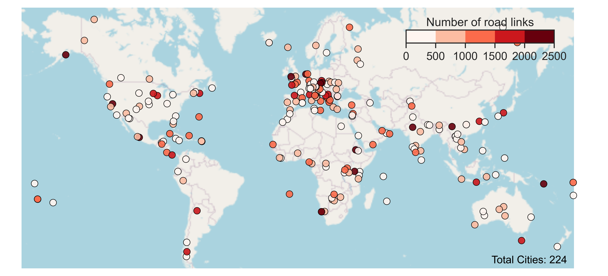
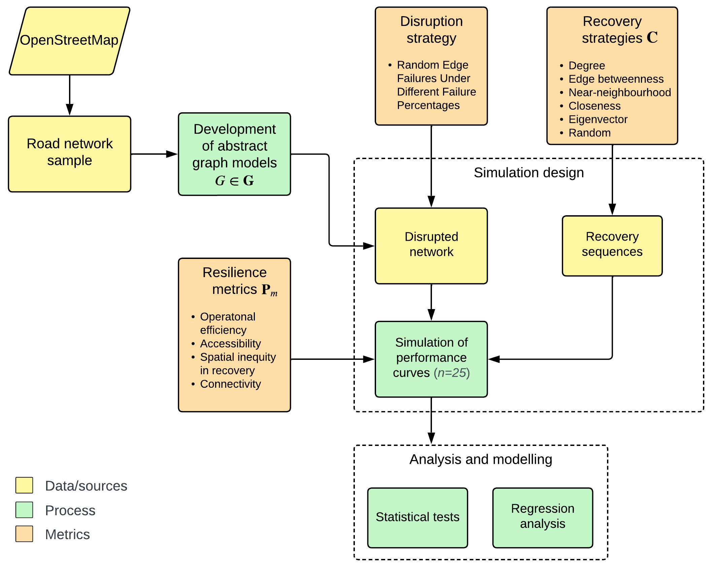
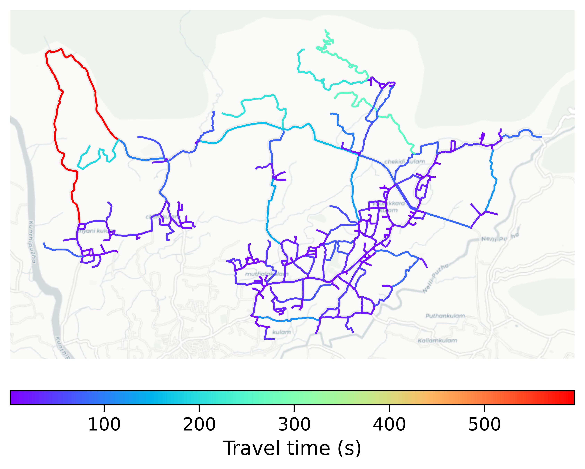
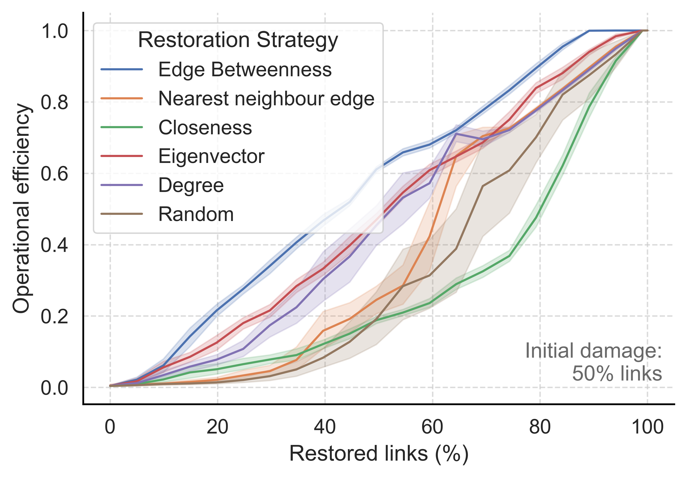

# Stresstesting road networks using topological metrics: Code and data

This repository contains the code, processed datasets, and scripts used to reproduce the experiments and figures in the paper **"Topology shapes road network recovery: Global evidence from 224 cities"** by Srijith Balakrishnan and Patrick Stokkink.

The study uses a large-scale simulation-based stress-testing framework to evaluate how urban road networks recover after disruptions. For each of 224 cities/towns (Figure 1), road networks extracted from OpenStreetMap are repeatedly damaged by random edge removals at varying intensities, and multiple recovery strategies are applied to restore connectivity. Multidimensional network performance is tracked throughout recovery to quantify resilience and identify structural trade-offs across cities.


*Figure 1. Locations of the 224 cities included in the study.*

---

## Methodology
Road networks from **OpenStreetMap** are converted into graph models using Python’s **`igraph`** package, where intersections are represented as nodes and road segments as edges. Network disruptions are simulated by progressively removing random edges to emulate real-world disturbances such as accidents or hazards. Recovery is modeled using five centrality-based strategies: **degree**, **edge betweenness**, **nearest neighbour edge**, **eigenvector**, and **closeness** alongside a random baseline. These strategies allow systematic evaluation of different prioritization approaches for restoring network connectivity and resilience and track recovery across four competing dimensions: efficiency, accessibility, equity, and connectivity.



*Figure 2. Methodology and workflow*

---

## Sample simulation outputs



*Figure 3. Simulated recovery curves based on operational efficiency metric under different recovery strategies when initial disruption is 50\% of links (Network: Thenkara, Kerala, India)*

## Repository structure

```
/data/road_networks      # Openstreet road network datasets
/src/                    # Simulation scripts
/results/                # Output figures, aggregated model results
requirements.txt         # Python dependencies
README.md                # This file
LICENSE                  # MIT License
```
---

## Citation

If you use this repository, please cite:

> Balakrishnan, S. & Stokkink, P. *Topology shapes road network recovery: Global evidence from 224 cities* (2025).

---

## License

The code is released under the **MIT License**.  
Road network data derived from **OpenStreetMap** are covered by the **ODbL license**.

---

## Contact

- Srijith Balakrishnan — s.balakrishnan@tudelft.nl  
- Patrick Stokkink — p.s.a.stokkink@tudelft.nl  

---

_Last updated: 2025-10-13_
