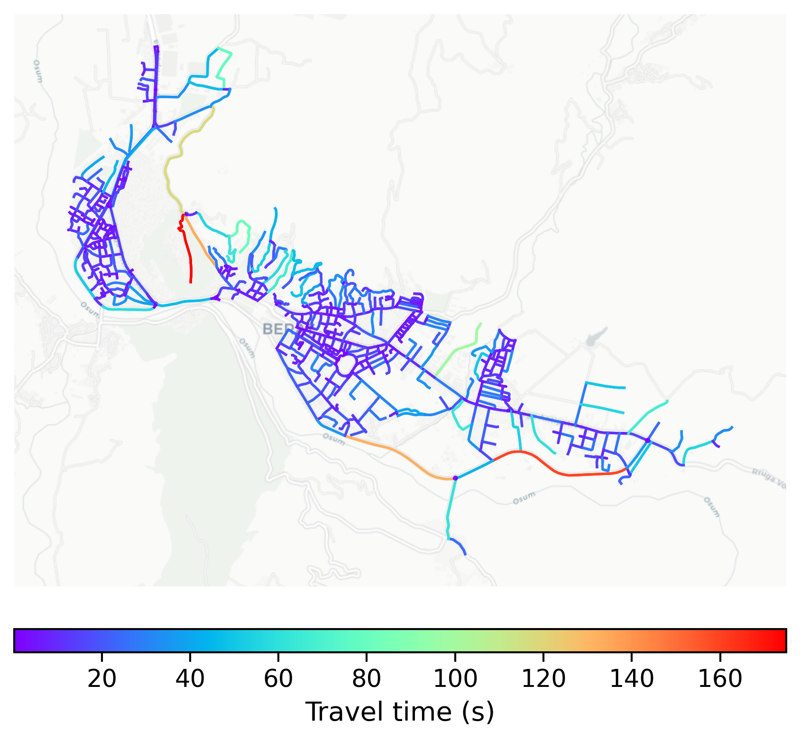

# Berat, Albania

#### Location Information

- **City**: Berat
- **Country**: Albania
- **Data Source**: OpenStreetMap

- **Analysis Date**: 2025-10-10

#### Road network topology

#### Network Characteristics

##### Basic Topology

- **Number of Nodes**: 695
- **Number of Edges**: 1,687
- **Network Density**: 0.003498
- **Average Node Degree**: 4.855
- **Standard Deviation of Node Degrees**: 1.807

##### Clustering Properties

- **Global Clustering Coefficient**: 0.052023
- **Average Local Clustering Coefficient**: 0.053939
- **Degree Assortativity Coefficient**: 0.014542

##### Spatial Metrics

- **Total Network Length (meters)**: 164113.11
- **Average Edge Length (meters)**: 97.28
- **Average Travel Time per Edge (seconds)**: 12.88

---
*Report generated on 2025-10-10 18:22:28*
