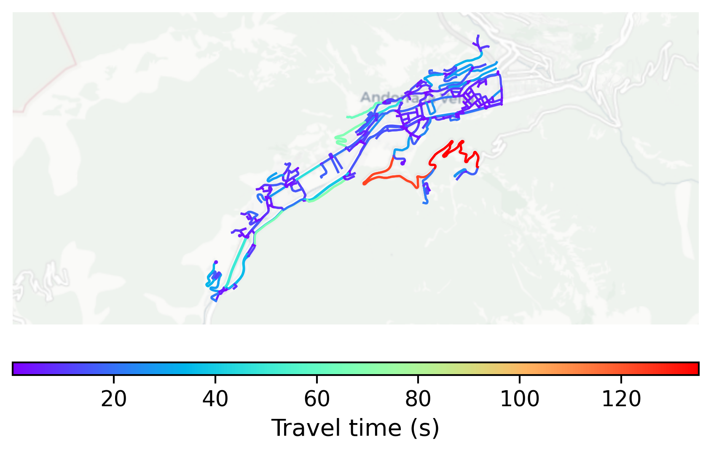

# Andorra_la_Vella, Andorra

#### Location Information

- **City**: Andorra_la_Vella
- **Country**: Andorra
- **Data Source**: OpenStreetMap

- **Analysis Date**: 2025-10-10

#### Road network topology

#### Network Characteristics

##### Basic Topology

- **Number of Nodes**: 384
- **Number of Edges**: 713
- **Network Density**: 0.004848
- **Average Node Degree**: 3.714
- **Standard Deviation of Node Degrees**: 1.311

##### Clustering Properties

- **Global Clustering Coefficient**: 0.132530
- **Average Local Clustering Coefficient**: 0.129503
- **Degree Assortativity Coefficient**: 0.164437

##### Spatial Metrics

- **Total Network Length (meters)**: 76371.67
- **Average Edge Length (meters)**: 107.11
- **Average Travel Time per Edge (seconds)**: 8.76

---
*Report generated on 2025-10-10 18:22:32*
