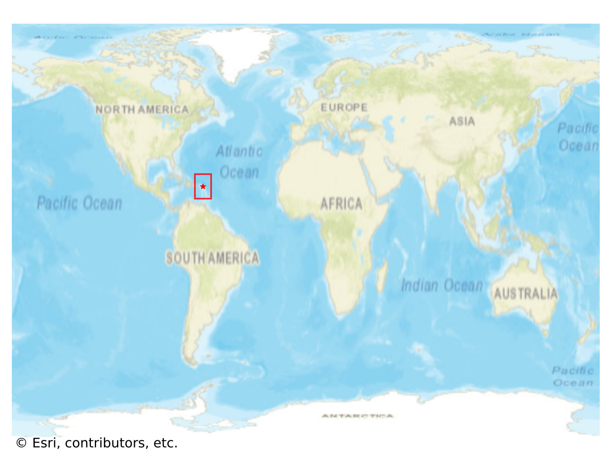

# South_Hill, Anguilla

#### Location Information

- **City**: South_Hill
- **Country**: Anguilla
- **Data Source**: OpenStreetMap

- **Analysis Date**: 2025-10-10

#### Road network topology

#### Network Characteristics

##### Basic Topology

- **Number of Nodes**: 807
- **Number of Edges**: 1,843
- **Network Density**: 0.002833
- **Average Node Degree**: 4.568
- **Standard Deviation of Node Degrees**: 1.877

##### Clustering Properties

- **Global Clustering Coefficient**: 0.082264
- **Average Local Clustering Coefficient**: 0.083627
- **Degree Assortativity Coefficient**: -0.032611

##### Spatial Metrics

- **Total Network Length (meters)**: 463878.06
- **Average Edge Length (meters)**: 251.70
- **Average Travel Time per Edge (seconds)**: 29.99

---
*Report generated on 2025-10-10 16:04:24*
