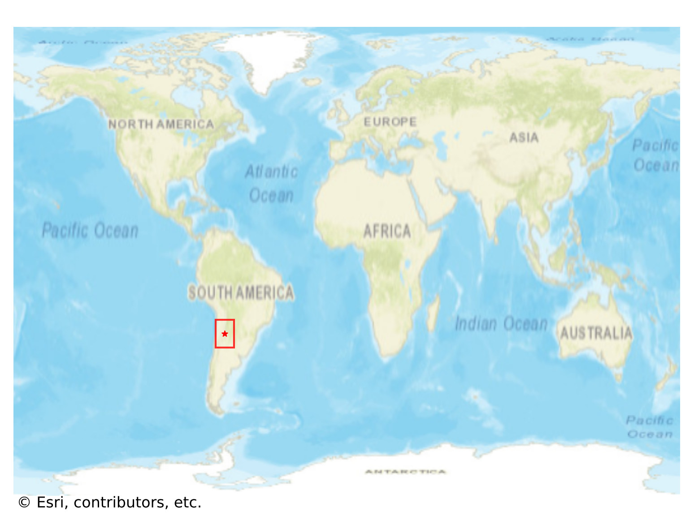
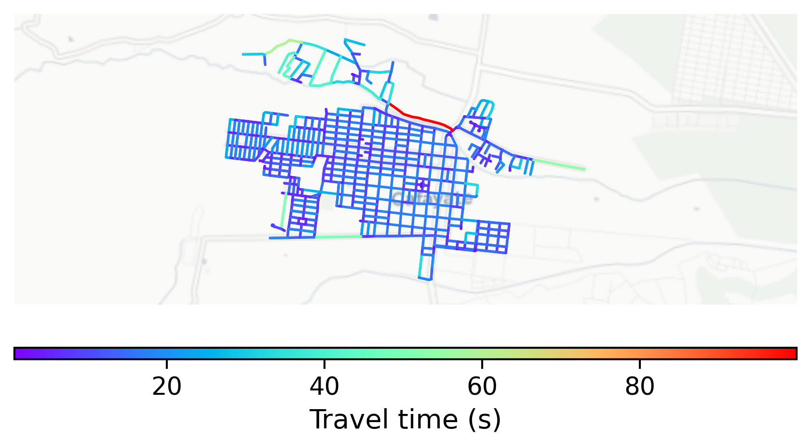

# Cafayate, Argentina

#### Location Information

- **City**: Cafayate
- **Country**: Argentina
- **Data Source**: OpenStreetMap

- **Analysis Date**: 2025-10-09

#### Road network topology

#### Network Characteristics

##### Basic Topology

- **Number of Nodes**: 490
- **Number of Edges**: 1,308
- **Network Density**: 0.005459
- **Average Node Degree**: 5.339
- **Standard Deviation of Node Degrees**: 1.563

##### Clustering Properties

- **Global Clustering Coefficient**: 0.038503
- **Average Local Clustering Coefficient**: 0.046142
- **Degree Assortativity Coefficient**: 0.313154

##### Spatial Metrics

- **Total Network Length (meters)**: 141686.12
- **Average Edge Length (meters)**: 108.32
- **Average Travel Time per Edge (seconds)**: 12.66

---
*Report generated on 2025-10-09 19:16:10*
