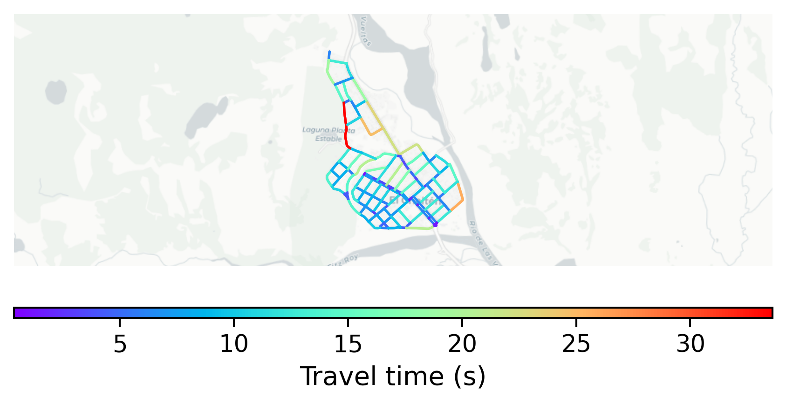

# El_Chalten, Argentina

#### Location Information

- **City**: El_Chalten
- **Country**: Argentina
- **Data Source**: OpenStreetMap

- **Analysis Date**: 2025-10-09

#### Road network topology

#### Network Characteristics

##### Basic Topology

- **Number of Nodes**: 98
- **Number of Edges**: 275
- **Network Density**: 0.028929
- **Average Node Degree**: 5.612
- **Standard Deviation of Node Degrees**: 1.314

##### Clustering Properties

- **Global Clustering Coefficient**: 0.035928
- **Average Local Clustering Coefficient**: 0.038194
- **Degree Assortativity Coefficient**: 0.345785

##### Spatial Metrics

- **Total Network Length (meters)**: 27070.52
- **Average Edge Length (meters)**: 98.44
- **Average Travel Time per Edge (seconds)**: 8.86

---
*Report generated on 2025-10-09 19:16:12*
