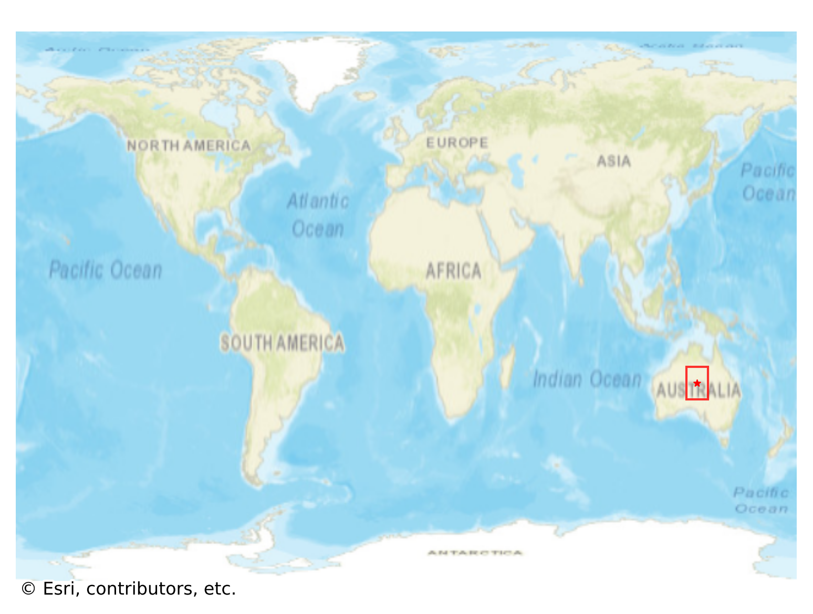
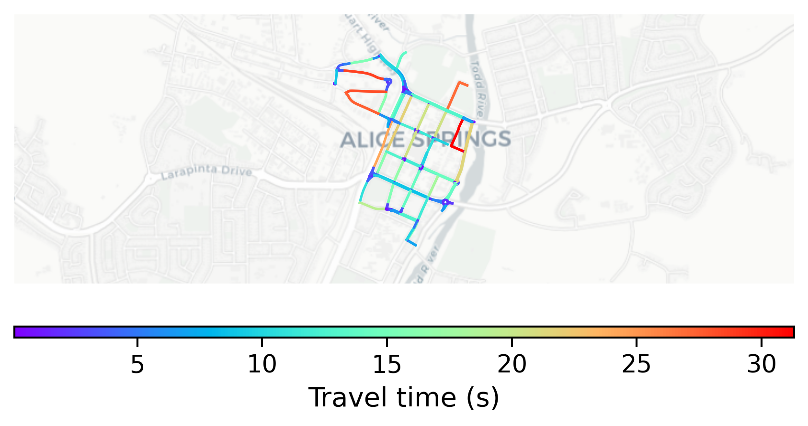

# Alice_Springs, Australia

#### Location Information

- **City**: Alice_Springs
- **Country**: Australia
- **Data Source**: OpenStreetMap

- **Analysis Date**: 2025-10-10

#### Road network topology

#### Network Characteristics

##### Basic Topology

- **Number of Nodes**: 132
- **Number of Edges**: 243
- **Network Density**: 0.014053
- **Average Node Degree**: 3.682
- **Standard Deviation of Node Degrees**: 1.257

##### Clustering Properties

- **Global Clustering Coefficient**: 0.162528
- **Average Local Clustering Coefficient**: 0.180208
- **Degree Assortativity Coefficient**: 0.360615

##### Spatial Metrics

- **Total Network Length (meters)**: 21015.05
- **Average Edge Length (meters)**: 86.48
- **Average Travel Time per Edge (seconds)**: 7.28

---
*Report generated on 2025-10-10 18:22:40*
