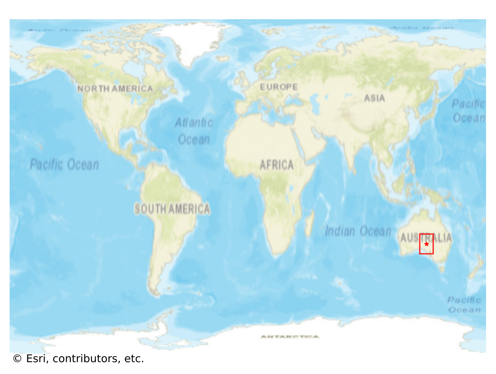

# Coober_Pedy, Australia

#### Location Information

- **City**: Coober_Pedy
- **Country**: Australia
- **Data Source**: OpenStreetMap

- **Analysis Date**: 2025-10-09

#### Road network topology

#### Network Characteristics

##### Basic Topology

- **Number of Nodes**: 415
- **Number of Edges**: 1,066
- **Network Density**: 0.006205
- **Average Node Degree**: 5.137
- **Standard Deviation of Node Degrees**: 1.696

##### Clustering Properties

- **Global Clustering Coefficient**: 0.052469
- **Average Local Clustering Coefficient**: 0.053498
- **Degree Assortativity Coefficient**: -0.058416

##### Spatial Metrics

- **Total Network Length (meters)**: 408889.80
- **Average Edge Length (meters)**: 383.57
- **Average Travel Time per Edge (seconds)**: 33.18

---
*Report generated on 2025-10-09 19:16:15*
