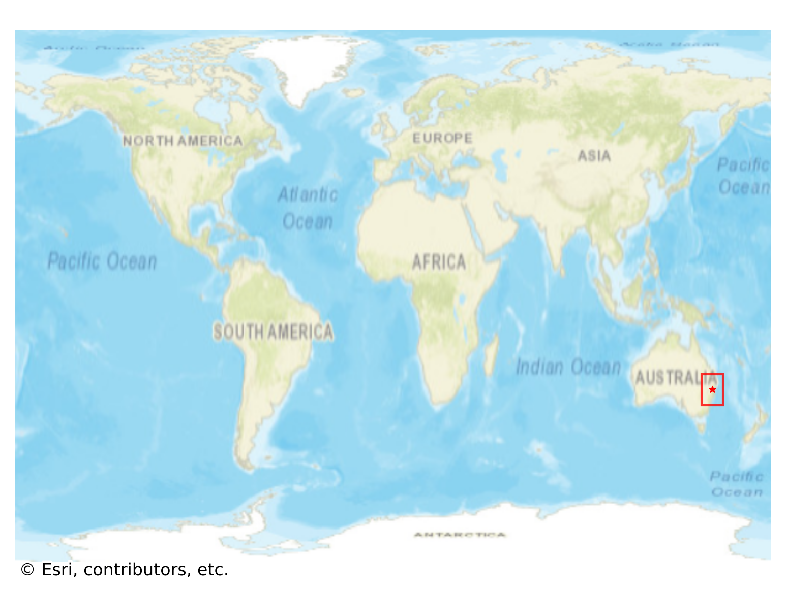
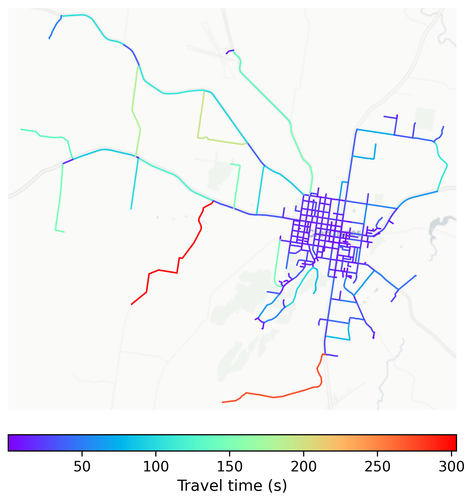

# Glen_Innes, Australia

#### Location Information

- **City**: Glen_Innes
- **Country**: Australia
- **Data Source**: OpenStreetMap

- **Analysis Date**: 2025-10-10

#### Road network topology

#### Network Characteristics

##### Basic Topology

- **Number of Nodes**: 358
- **Number of Edges**: 888
- **Network Density**: 0.006948
- **Average Node Degree**: 4.961
- **Standard Deviation of Node Degrees**: 2.022

##### Clustering Properties

- **Global Clustering Coefficient**: 0.051331
- **Average Local Clustering Coefficient**: 0.052134
- **Degree Assortativity Coefficient**: 0.305287

##### Spatial Metrics

- **Total Network Length (meters)**: 341438.52
- **Average Edge Length (meters)**: 384.50
- **Average Travel Time per Edge (seconds)**: 21.82

---
*Report generated on 2025-10-10 18:22:45*
