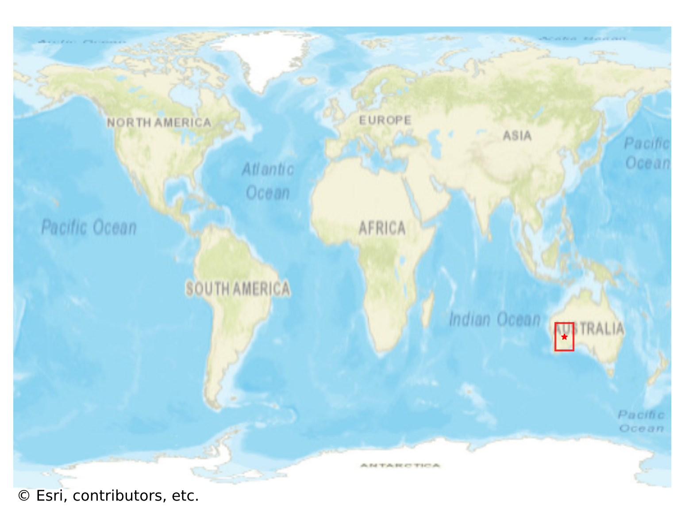
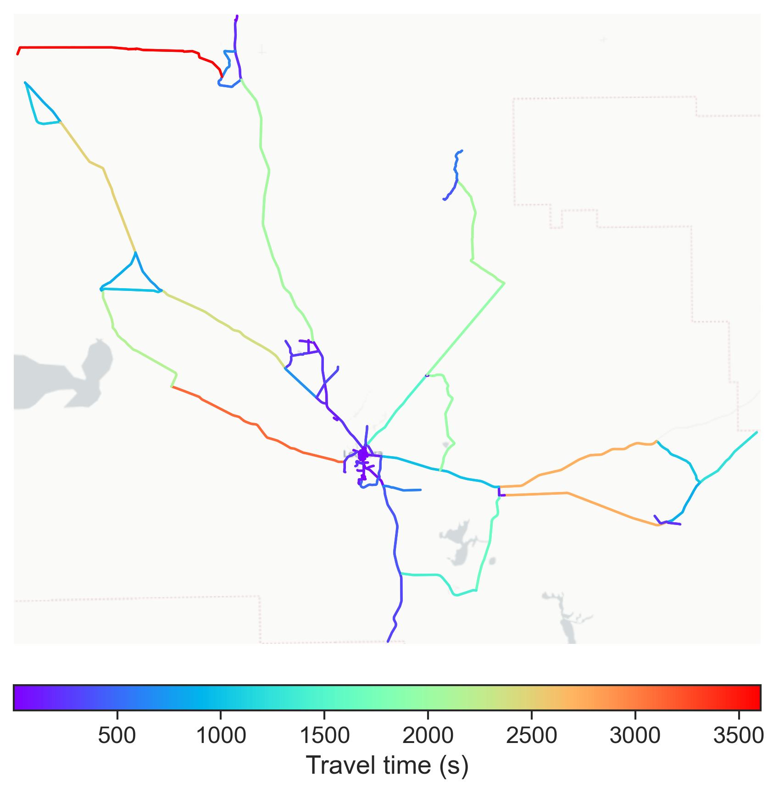

# Leonora, Australia

#### Location Information

- **City**: Leonora
- **Country**: Australia
- **Data Source**: OpenStreetMap

- **Analysis Date**: 2025-10-10

#### Road network topology

#### Network Characteristics

##### Basic Topology

- **Number of Nodes**: 148
- **Number of Edges**: 360
- **Network Density**: 0.016547
- **Average Node Degree**: 4.865
- **Standard Deviation of Node Degrees**: 2.107

##### Clustering Properties

- **Global Clustering Coefficient**: 0.052174
- **Average Local Clustering Coefficient**: 0.059406
- **Degree Assortativity Coefficient**: -0.126841

##### Spatial Metrics

- **Total Network Length (meters)**: 1029641.24
- **Average Edge Length (meters)**: 2860.11
- **Average Travel Time per Edge (seconds)**: 306.44

---
*Report generated on 2025-10-10 16:04:37*
