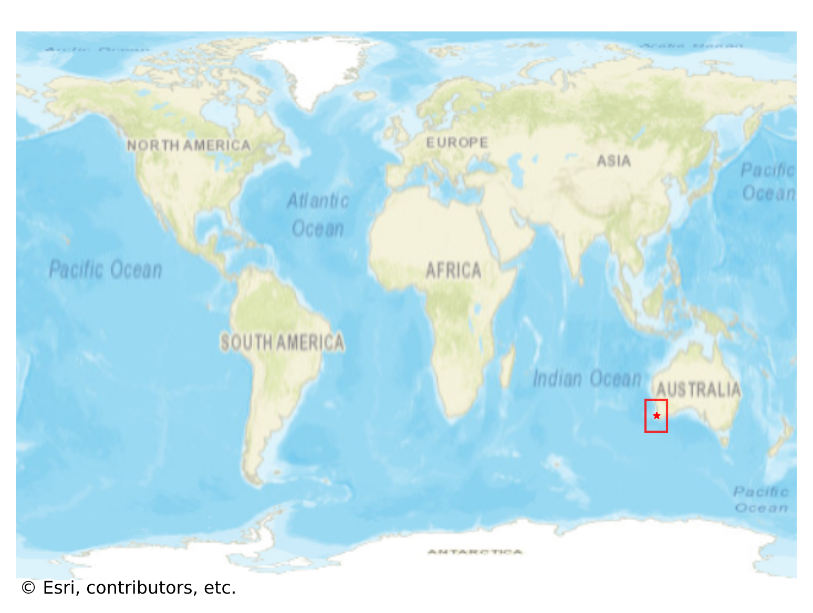
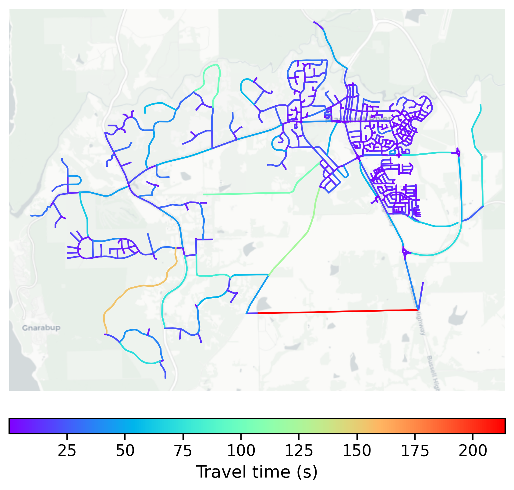

# Margaret_River, Australia

#### Location Information

- **City**: Margaret_River
- **Country**: Australia
- **Data Source**: OpenStreetMap

- **Analysis Date**: 2025-10-10

#### Road network topology

#### Network Characteristics

##### Basic Topology

- **Number of Nodes**: 676
- **Number of Edges**: 1,601
- **Network Density**: 0.003509
- **Average Node Degree**: 4.737
- **Standard Deviation of Node Degrees**: 1.754

##### Clustering Properties

- **Global Clustering Coefficient**: 0.065854
- **Average Local Clustering Coefficient**: 0.068182
- **Degree Assortativity Coefficient**: 0.066031

##### Spatial Metrics

- **Total Network Length (meters)**: 309250.48
- **Average Edge Length (meters)**: 193.16
- **Average Travel Time per Edge (seconds)**: 11.45

---
*Report generated on 2025-10-10 16:04:42*
