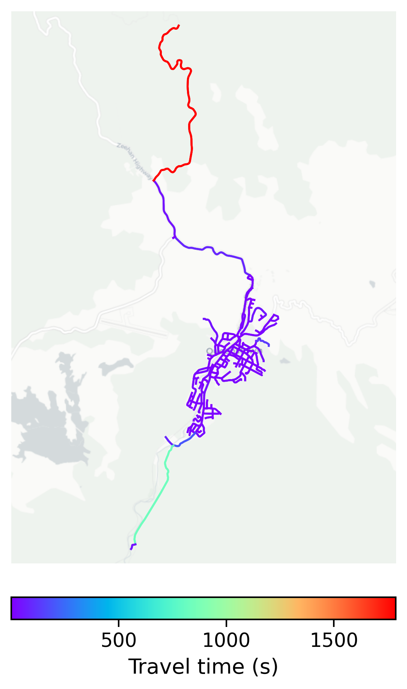

# Queenstown, Australia

#### Location Information

- **City**: Queenstown
- **Country**: Australia
- **Data Source**: OpenStreetMap

- **Analysis Date**: 2025-10-10

#### Road network topology

#### Network Characteristics

##### Basic Topology

- **Number of Nodes**: 199
- **Number of Edges**: 472
- **Network Density**: 0.011979
- **Average Node Degree**: 4.744
- **Standard Deviation of Node Degrees**: 2.030

##### Clustering Properties

- **Global Clustering Coefficient**: 0.066225
- **Average Local Clustering Coefficient**: 0.068127
- **Degree Assortativity Coefficient**: 0.039475

##### Spatial Metrics

- **Total Network Length (meters)**: 79411.92
- **Average Edge Length (meters)**: 168.25
- **Average Travel Time per Edge (seconds)**: 22.63

---
*Report generated on 2025-10-10 18:22:54*
