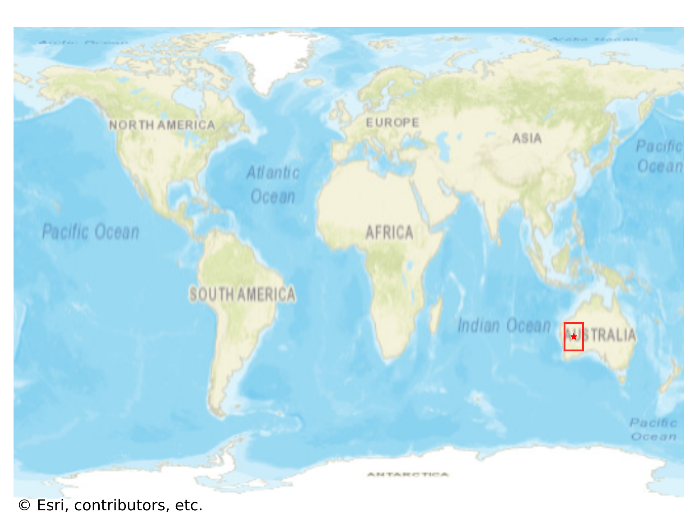

# Wiluna, Australia

#### Location Information

- **City**: Wiluna
- **Country**: Australia
- **Data Source**: OpenStreetMap

- **Analysis Date**: 2025-10-09

#### Road network topology

#### Network Characteristics

##### Basic Topology

- **Number of Nodes**: 230
- **Number of Edges**: 575
- **Network Density**: 0.010917
- **Average Node Degree**: 5.000
- **Standard Deviation of Node Degrees**: 1.978

##### Clustering Properties

- **Global Clustering Coefficient**: 0.073034
- **Average Local Clustering Coefficient**: 0.078189
- **Degree Assortativity Coefficient**: -0.099295

##### Spatial Metrics

- **Total Network Length (meters)**: 3103522.61
- **Average Edge Length (meters)**: 5397.43
- **Average Travel Time per Edge (seconds)**: 647.69

---
*Report generated on 2025-10-09 19:16:19*
