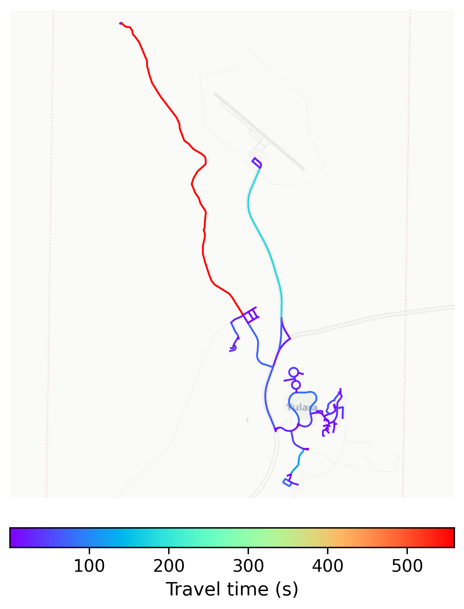

# Yulara, Australia

#### Location Information

- **City**: Yulara
- **Country**: Australia
- **Data Source**: OpenStreetMap

- **Analysis Date**: 2025-10-10

#### Road network topology

#### Network Characteristics

##### Basic Topology

- **Number of Nodes**: 88
- **Number of Edges**: 195
- **Network Density**: 0.025470
- **Average Node Degree**: 4.432
- **Standard Deviation of Node Degrees**: 1.677

##### Clustering Properties

- **Global Clustering Coefficient**: 0.171429
- **Average Local Clustering Coefficient**: 0.191919
- **Degree Assortativity Coefficient**: 0.115899

##### Spatial Metrics

- **Total Network Length (meters)**: 60710.55
- **Average Edge Length (meters)**: 311.34
- **Average Travel Time per Edge (seconds)**: 25.27

---
*Report generated on 2025-10-10 16:04:52*
