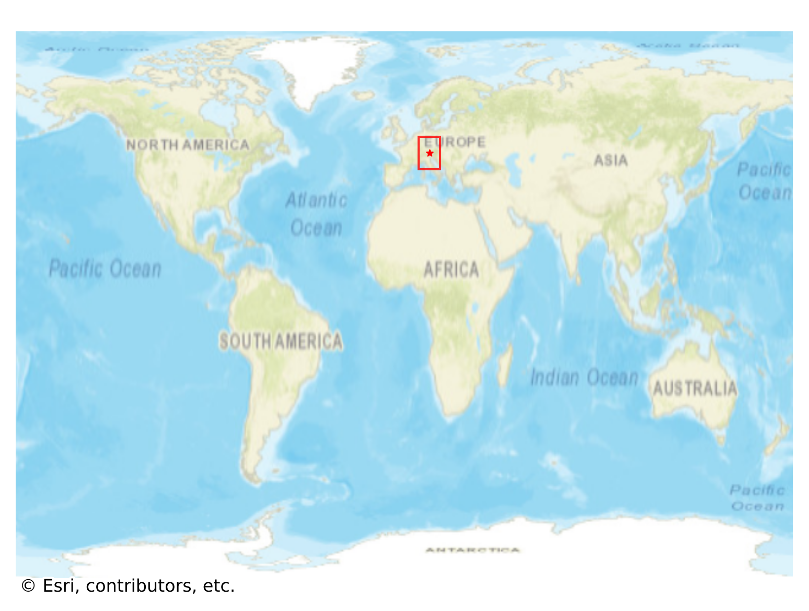
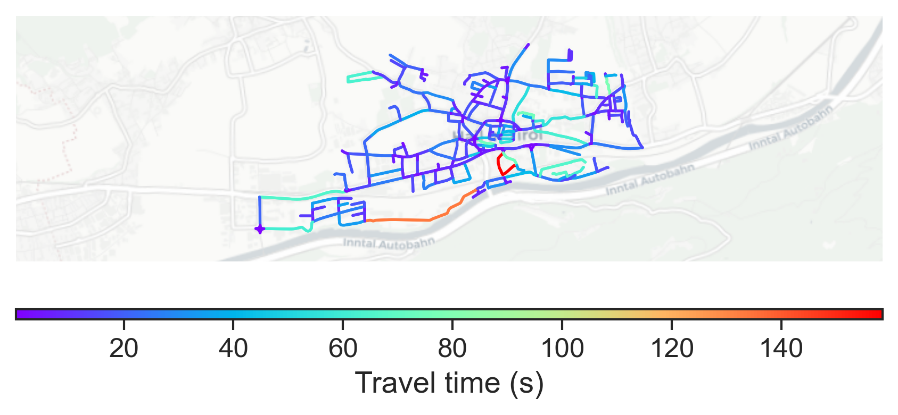

# Hall_in_Tirol, Austria

#### Location Information

- **City**: Hall_in_Tirol
- **Country**: Austria
- **Data Source**: OpenStreetMap

- **Analysis Date**: 2025-10-10

#### Road network topology

#### Network Characteristics

##### Basic Topology

- **Number of Nodes**: 295
- **Number of Edges**: 643
- **Network Density**: 0.007414
- **Average Node Degree**: 4.359
- **Standard Deviation of Node Degrees**: 1.649

##### Clustering Properties

- **Global Clustering Coefficient**: 0.108069
- **Average Local Clustering Coefficient**: 0.112045
- **Degree Assortativity Coefficient**: 0.110023

##### Spatial Metrics

- **Total Network Length (meters)**: 78845.97
- **Average Edge Length (meters)**: 122.62
- **Average Travel Time per Edge (seconds)**: 16.18

---
*Report generated on 2025-10-10 18:23:01*
