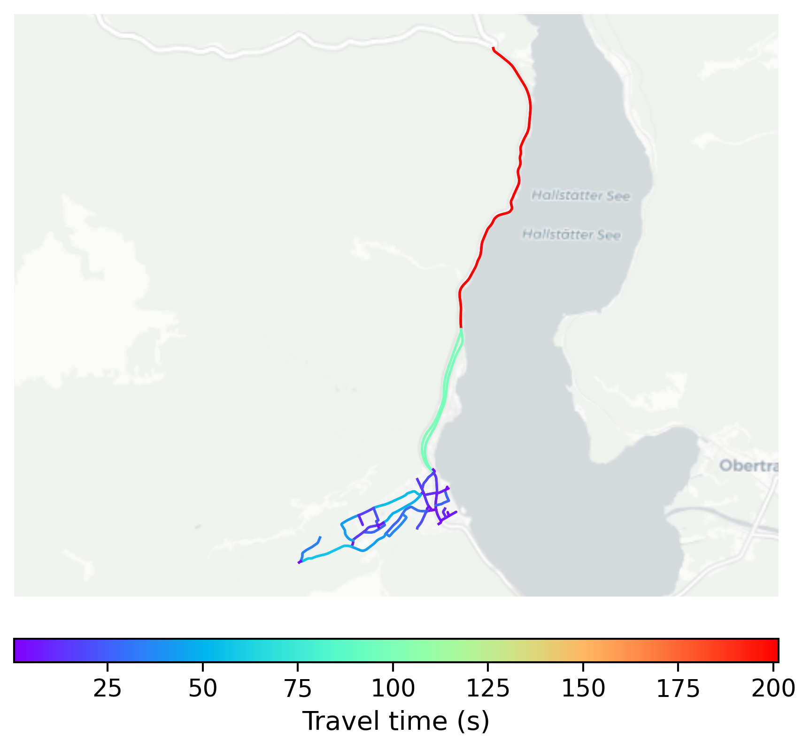

# Hallstatt, Austria

#### Location Information

- **City**: Hallstatt
- **Country**: Austria
- **Data Source**: OpenStreetMap

- **Analysis Date**: 2025-10-10

#### Road network topology

#### Network Characteristics

##### Basic Topology

- **Number of Nodes**: 42
- **Number of Edges**: 98
- **Network Density**: 0.056911
- **Average Node Degree**: 4.667
- **Standard Deviation of Node Degrees**: 2.123

##### Clustering Properties

- **Global Clustering Coefficient**: 0.105882
- **Average Local Clustering Coefficient**: 0.092593
- **Degree Assortativity Coefficient**: -0.147419

##### Spatial Metrics

- **Total Network Length (meters)**: 20751.62
- **Average Edge Length (meters)**: 211.75
- **Average Travel Time per Edge (seconds)**: 20.91

---
*Report generated on 2025-10-10 16:04:53*
