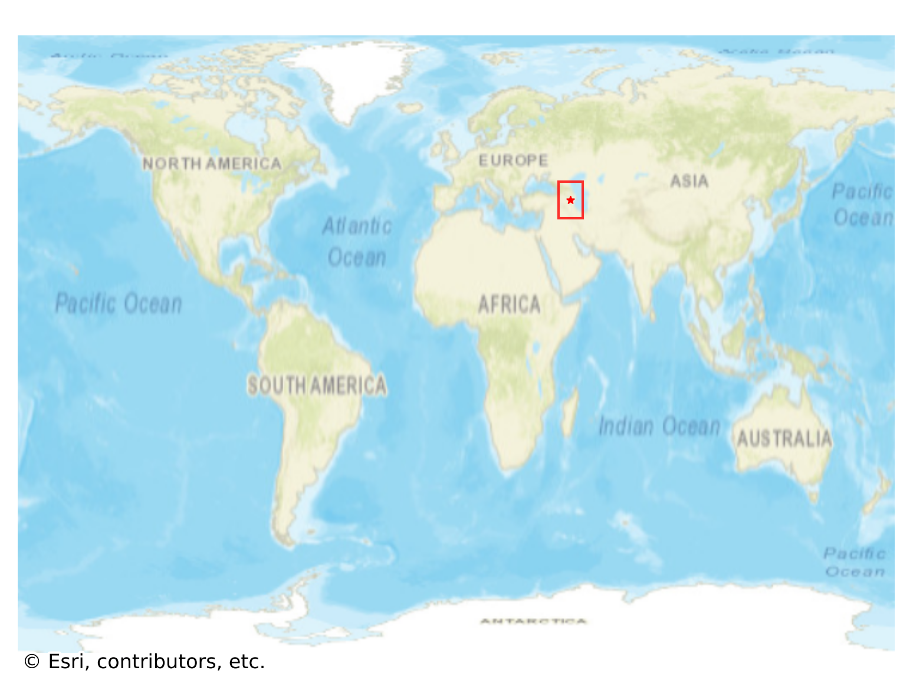
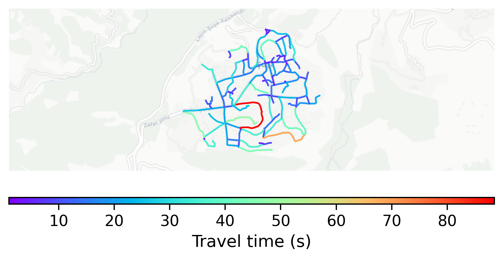

# Shusha, Azerbaijan

#### Location Information

- **City**: Shusha
- **Country**: Azerbaijan
- **Data Source**: OpenStreetMap

- **Analysis Date**: 2025-10-10

#### Road network topology

#### Network Characteristics

##### Basic Topology

- **Number of Nodes**: 103
- **Number of Edges**: 260
- **Network Density**: 0.024748
- **Average Node Degree**: 5.049
- **Standard Deviation of Node Degrees**: 2.045

##### Clustering Properties

- **Global Clustering Coefficient**: 0.059524
- **Average Local Clustering Coefficient**: 0.070175
- **Degree Assortativity Coefficient**: -0.131622

##### Spatial Metrics

- **Total Network Length (meters)**: 46935.24
- **Average Edge Length (meters)**: 180.52
- **Average Travel Time per Edge (seconds)**: 17.35

---
*Report generated on 2025-10-10 16:04:59*
