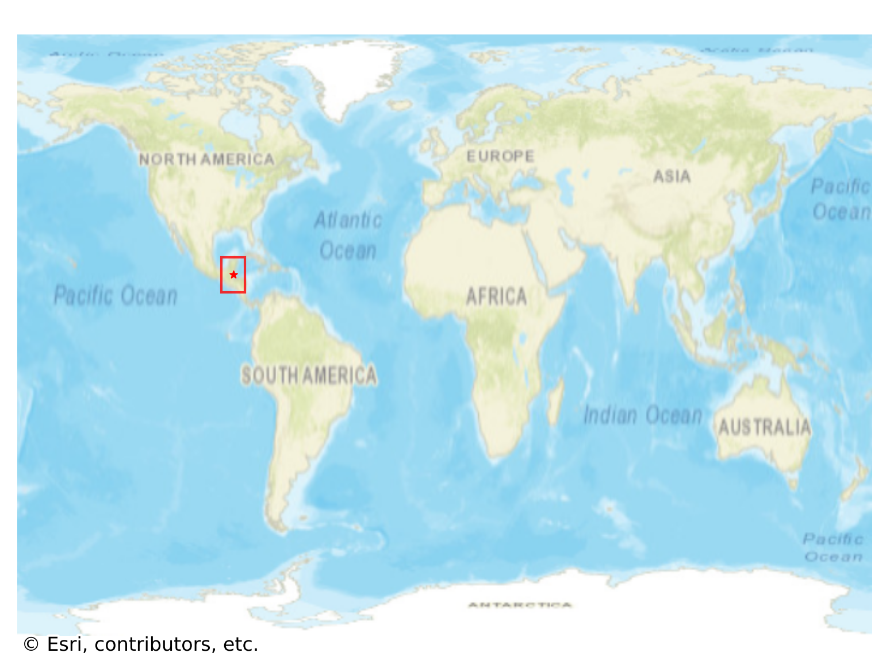
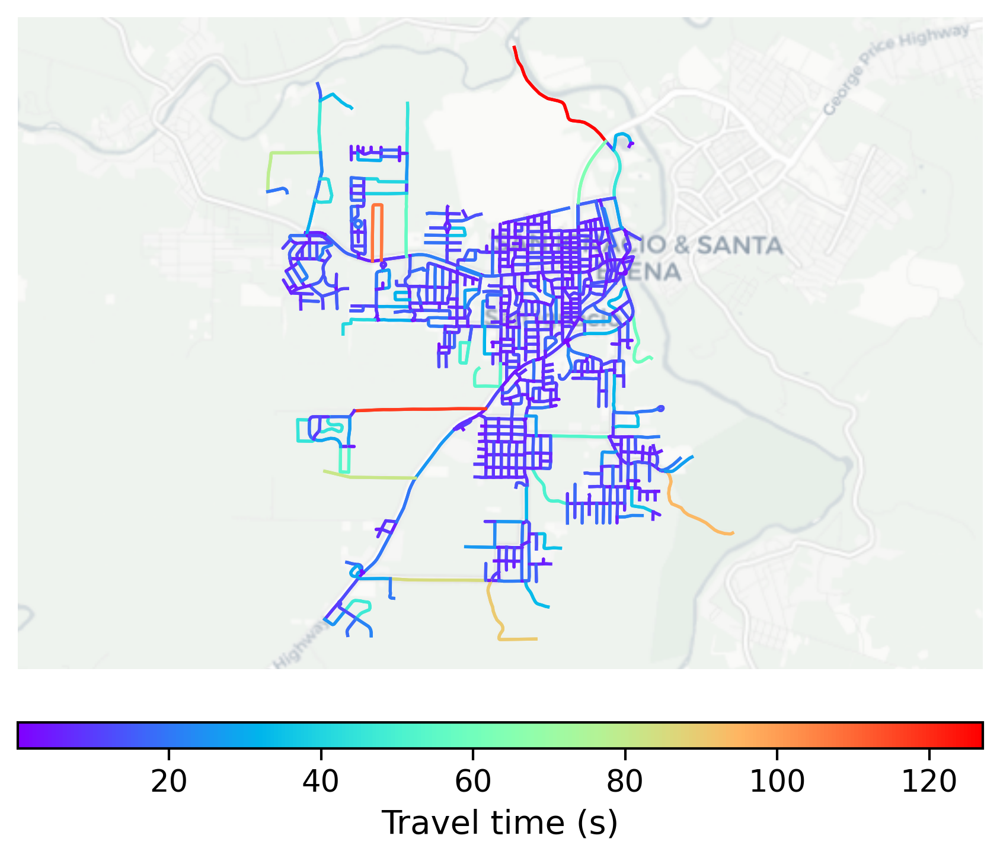

# San_Ignacio, Belize

#### Location Information

- **City**: San_Ignacio
- **Country**: Belize
- **Data Source**: OpenStreetMap

- **Analysis Date**: 2025-10-10

#### Road network topology

#### Network Characteristics

##### Basic Topology

- **Number of Nodes**: 885
- **Number of Edges**: 2,370
- **Network Density**: 0.003029
- **Average Node Degree**: 5.356
- **Standard Deviation of Node Degrees**: 1.802

##### Clustering Properties

- **Global Clustering Coefficient**: 0.040195
- **Average Local Clustering Coefficient**: 0.045372
- **Degree Assortativity Coefficient**: 0.055915

##### Spatial Metrics

- **Total Network Length (meters)**: 265290.81
- **Average Edge Length (meters)**: 111.94
- **Average Travel Time per Edge (seconds)**: 9.78

---
*Report generated on 2025-10-10 18:23:07*
