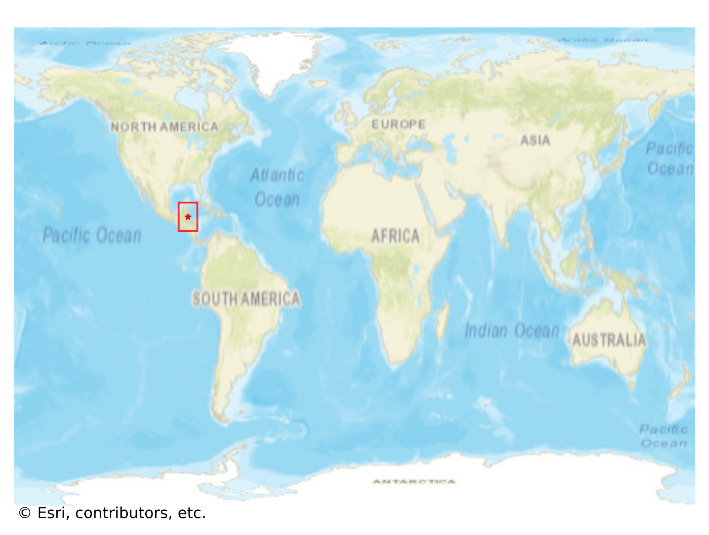
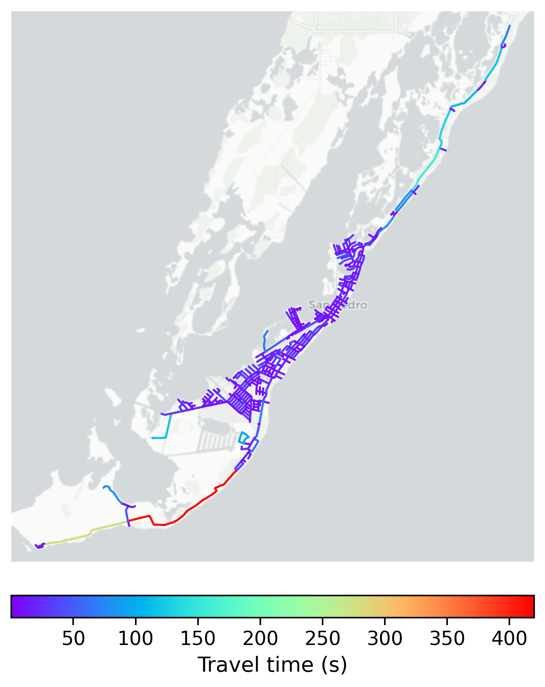

# San_Pedro, Belize

#### Location Information

- **City**: San_Pedro
- **Country**: Belize
- **Data Source**: OpenStreetMap

- **Analysis Date**: 2025-10-10

#### Road network topology

#### Network Characteristics

##### Basic Topology

- **Number of Nodes**: 470
- **Number of Edges**: 1,161
- **Network Density**: 0.005267
- **Average Node Degree**: 4.940
- **Standard Deviation of Node Degrees**: 2.017

##### Clustering Properties

- **Global Clustering Coefficient**: 0.052174
- **Average Local Clustering Coefficient**: 0.052114
- **Degree Assortativity Coefficient**: -0.021254

##### Spatial Metrics

- **Total Network Length (meters)**: 125601.87
- **Average Edge Length (meters)**: 108.18
- **Average Travel Time per Edge (seconds)**: 15.86

---
*Report generated on 2025-10-10 16:05:07*
