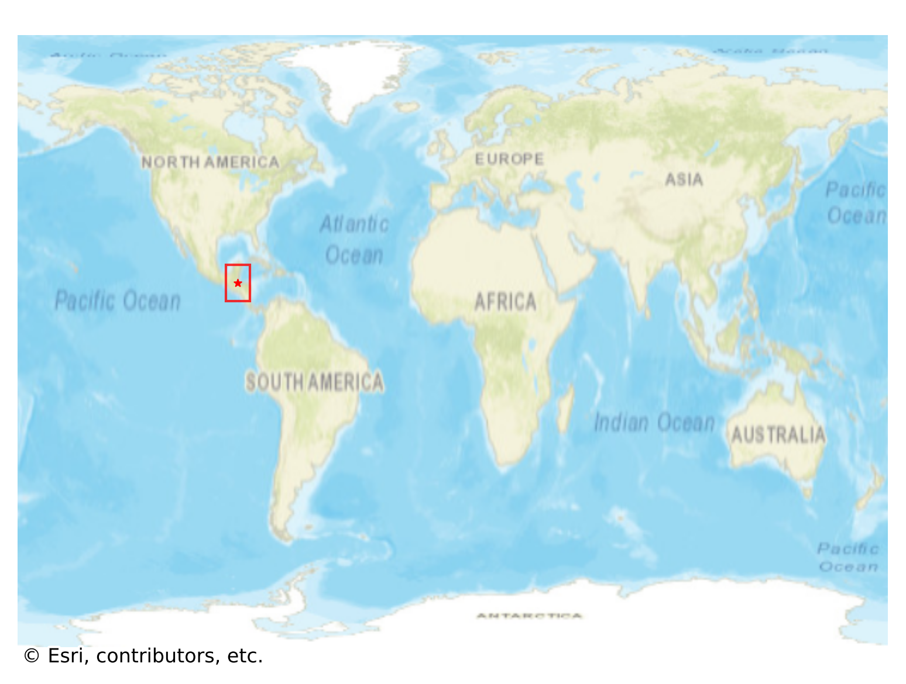
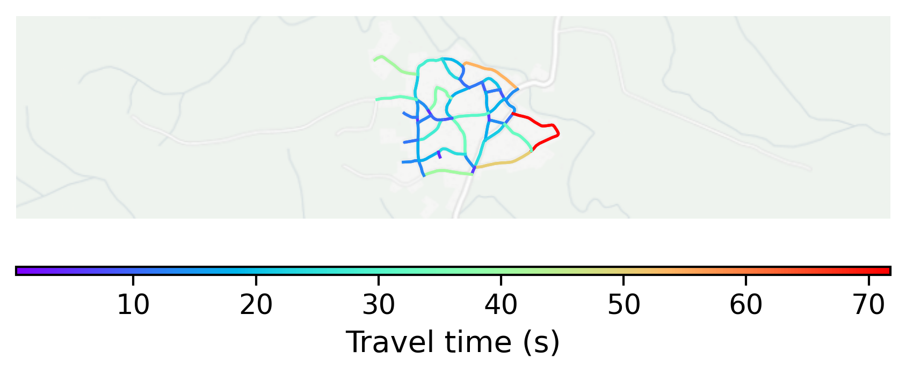

# San_Pedro_Columbia, Belize

#### Location Information

- **City**: San_Pedro_Columbia
- **Country**: Belize
- **Data Source**: OpenStreetMap

- **Analysis Date**: 2025-10-10

#### Road network topology

#### Network Characteristics

##### Basic Topology

- **Number of Nodes**: 40
- **Number of Edges**: 110
- **Network Density**: 0.070513
- **Average Node Degree**: 5.500
- **Standard Deviation of Node Degrees**: 1.718

##### Clustering Properties

- **Global Clustering Coefficient**: 0.054054
- **Average Local Clustering Coefficient**: 0.058824
- **Degree Assortativity Coefficient**: -0.160844

##### Spatial Metrics

- **Total Network Length (meters)**: 17443.32
- **Average Edge Length (meters)**: 158.58
- **Average Travel Time per Edge (seconds)**: 19.03

---
*Report generated on 2025-10-10 16:05:08*
