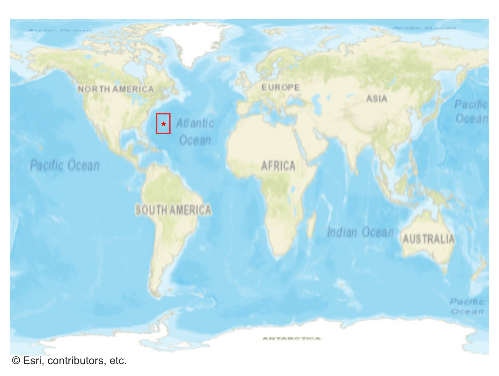
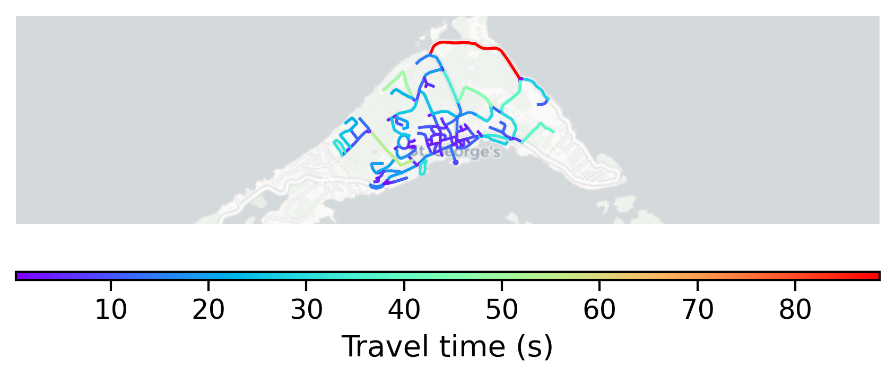

# St_Georges, Bermuda

#### Location Information

- **City**: St_Georges
- **Country**: Bermuda
- **Data Source**: OpenStreetMap

- **Analysis Date**: 2025-10-10

#### Road network topology

#### Network Characteristics

##### Basic Topology

- **Number of Nodes**: 128
- **Number of Edges**: 281
- **Network Density**: 0.017286
- **Average Node Degree**: 4.391
- **Standard Deviation of Node Degrees**: 1.669

##### Clustering Properties

- **Global Clustering Coefficient**: 0.078067
- **Average Local Clustering Coefficient**: 0.072695
- **Degree Assortativity Coefficient**: 0.076196

##### Spatial Metrics

- **Total Network Length (meters)**: 26355.72
- **Average Edge Length (meters)**: 93.79
- **Average Travel Time per Edge (seconds)**: 11.35

---
*Report generated on 2025-10-10 16:05:11*
