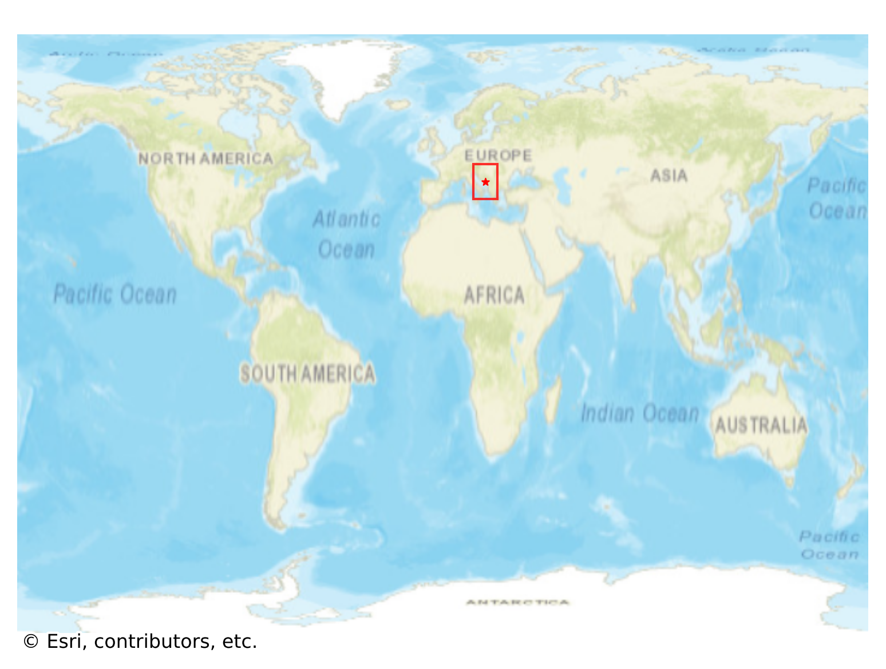
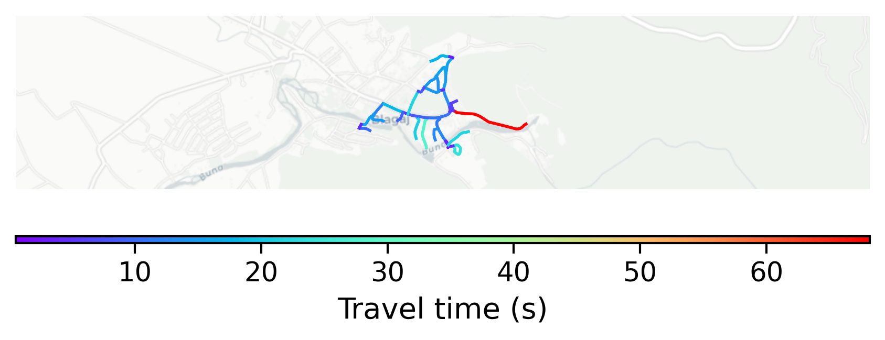

# Blagaj, Bosnia and Herzegovina

#### Location Information

- **City**: Blagaj
- **Country**: Bosnia and Herzegovina
- **Data Source**: OpenStreetMap

- **Analysis Date**: 2025-10-10

#### Road network topology

#### Network Characteristics

##### Basic Topology

- **Number of Nodes**: 39
- **Number of Edges**: 90
- **Network Density**: 0.060729
- **Average Node Degree**: 4.615
- **Standard Deviation of Node Degrees**: 1.876

##### Clustering Properties

- **Global Clustering Coefficient**: 0.047619
- **Average Local Clustering Coefficient**: 0.037037
- **Degree Assortativity Coefficient**: 0.197052

##### Spatial Metrics

- **Total Network Length (meters)**: 8748.17
- **Average Edge Length (meters)**: 97.20
- **Average Travel Time per Edge (seconds)**: 11.66

---
*Report generated on 2025-10-10 16:05:13*
