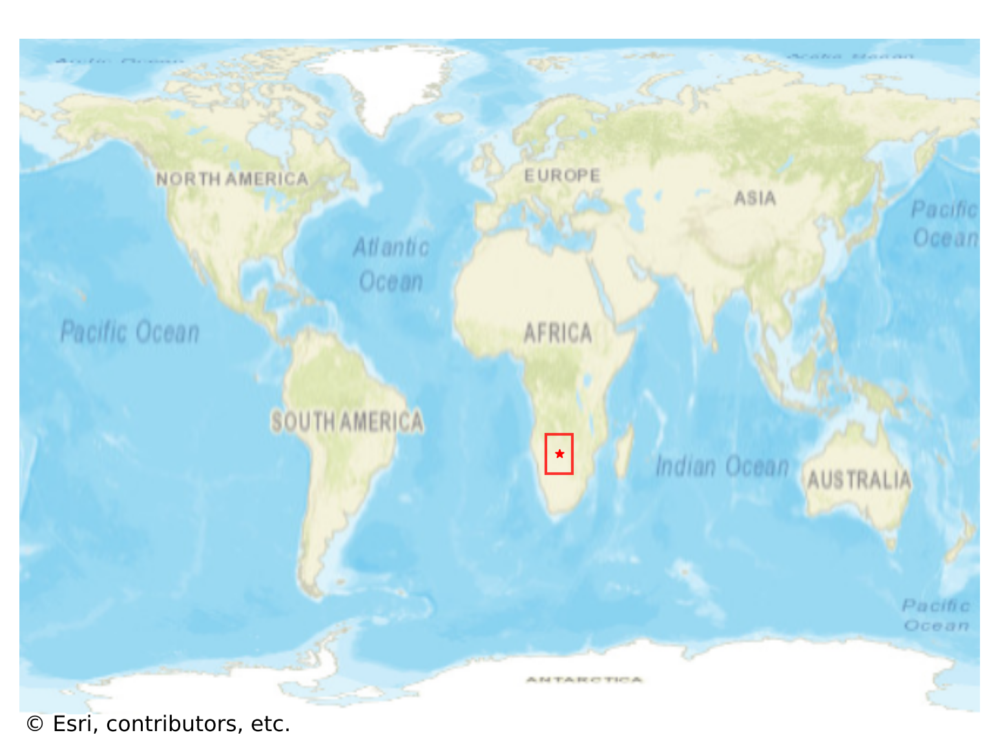

# Gumare, Botswana

#### Location Information

- **City**: Gumare
- **Country**: Botswana
- **Data Source**: OpenStreetMap

- **Analysis Date**: 2025-10-10

#### Road network topology

#### Network Characteristics

##### Basic Topology

- **Number of Nodes**: 538
- **Number of Edges**: 1,461
- **Network Density**: 0.005057
- **Average Node Degree**: 5.431
- **Standard Deviation of Node Degrees**: 1.744

##### Clustering Properties

- **Global Clustering Coefficient**: 0.089708
- **Average Local Clustering Coefficient**: 0.085812
- **Degree Assortativity Coefficient**: -0.084154

##### Spatial Metrics

- **Total Network Length (meters)**: 182026.48
- **Average Edge Length (meters)**: 124.59
- **Average Travel Time per Edge (seconds)**: 13.02

---
*Report generated on 2025-10-10 18:23:19*
