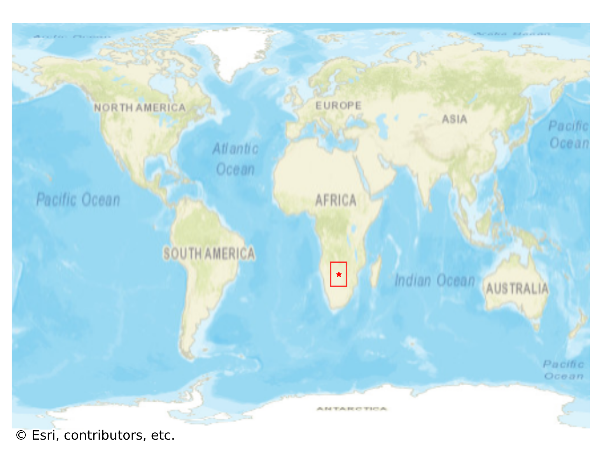
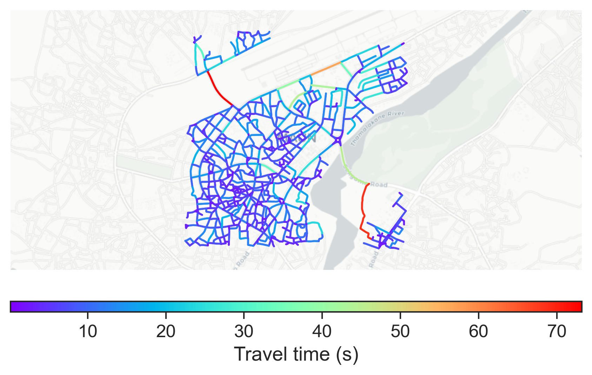

# Maun, Botswana

#### Location Information

- **City**: Maun
- **Country**: Botswana
- **Data Source**: OpenStreetMap

- **Analysis Date**: 2025-10-10

#### Road network topology

#### Network Characteristics

##### Basic Topology

- **Number of Nodes**: 678
- **Number of Edges**: 1,926
- **Network Density**: 0.004196
- **Average Node Degree**: 5.681
- **Standard Deviation of Node Degrees**: 1.394

##### Clustering Properties

- **Global Clustering Coefficient**: 0.059724
- **Average Local Clustering Coefficient**: 0.062667
- **Degree Assortativity Coefficient**: 0.187129

##### Spatial Metrics

- **Total Network Length (meters)**: 181130.50
- **Average Edge Length (meters)**: 94.04
- **Average Travel Time per Edge (seconds)**: 7.38

---
*Report generated on 2025-10-10 16:05:23*
