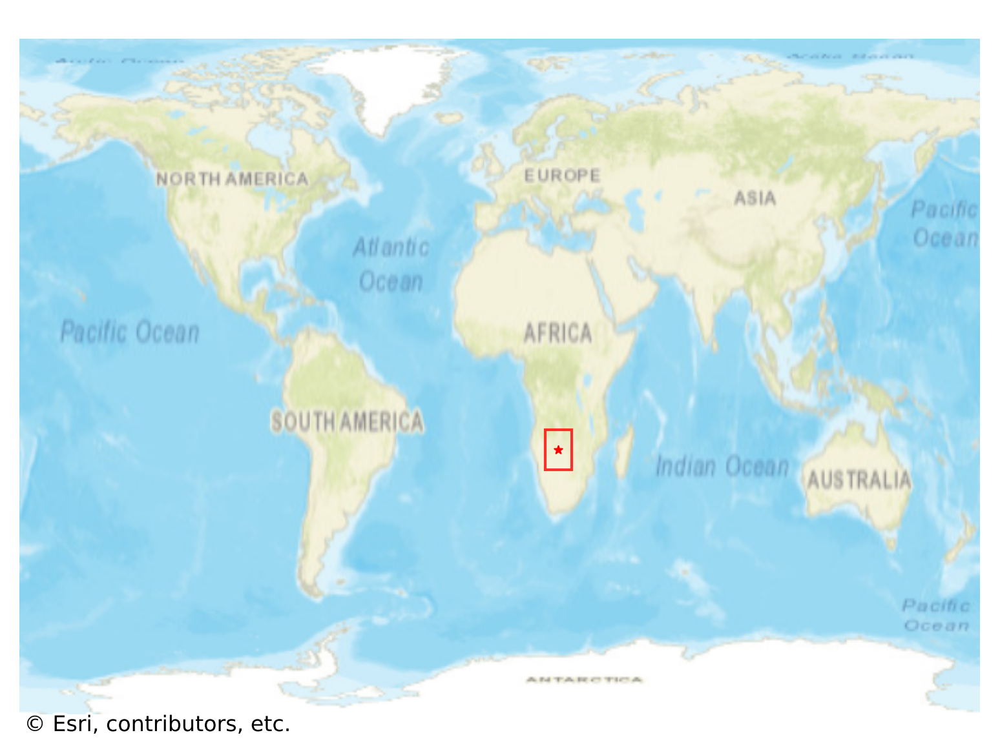

# Shakawe, Botswana

#### Location Information

- **City**: Shakawe
- **Country**: Botswana
- **Data Source**: OpenStreetMap

- **Analysis Date**: 2025-10-10

#### Road network topology

#### Network Characteristics

##### Basic Topology

- **Number of Nodes**: 163
- **Number of Edges**: 459
- **Network Density**: 0.017382
- **Average Node Degree**: 5.632
- **Standard Deviation of Node Degrees**: 1.469

##### Clustering Properties

- **Global Clustering Coefficient**: 0.100446
- **Average Local Clustering Coefficient**: 0.092075
- **Degree Assortativity Coefficient**: 0.035988

##### Spatial Metrics

- **Total Network Length (meters)**: 81944.36
- **Average Edge Length (meters)**: 178.53
- **Average Travel Time per Edge (seconds)**: 13.54

---
*Report generated on 2025-10-10 18:23:25*
