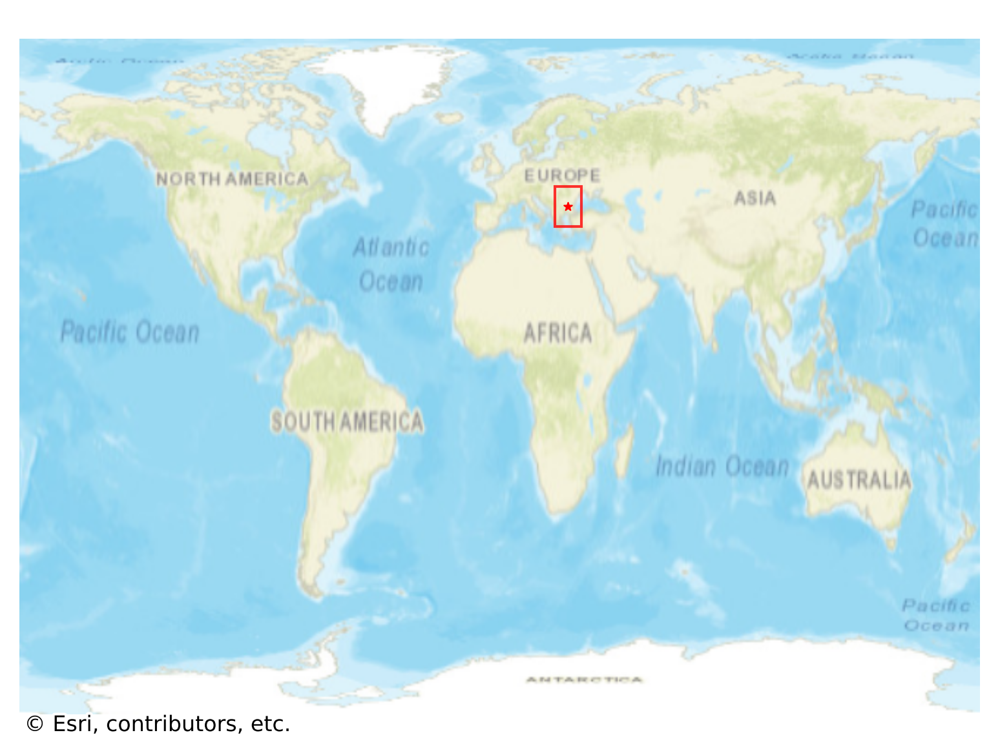
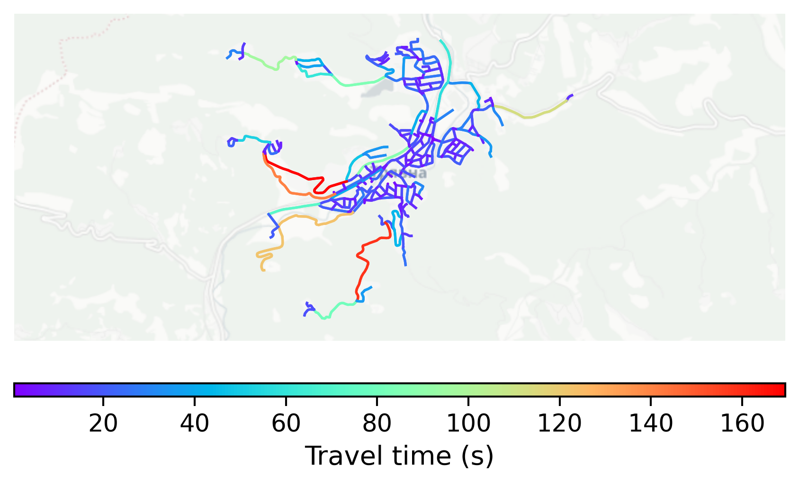

# Tryavna, Bulgaria

#### Location Information

- **City**: Tryavna
- **Country**: Bulgaria
- **Data Source**: OpenStreetMap

- **Analysis Date**: 2025-10-10

#### Road network topology

#### Network Characteristics

##### Basic Topology

- **Number of Nodes**: 244
- **Number of Edges**: 594
- **Network Density**: 0.010018
- **Average Node Degree**: 4.869
- **Standard Deviation of Node Degrees**: 1.892

##### Clustering Properties

- **Global Clustering Coefficient**: 0.097603
- **Average Local Clustering Coefficient**: 0.096920
- **Degree Assortativity Coefficient**: -0.017587

##### Spatial Metrics

- **Total Network Length (meters)**: 87954.09
- **Average Edge Length (meters)**: 148.07
- **Average Travel Time per Edge (seconds)**: 17.77

---
*Report generated on 2025-10-10 18:23:26*
