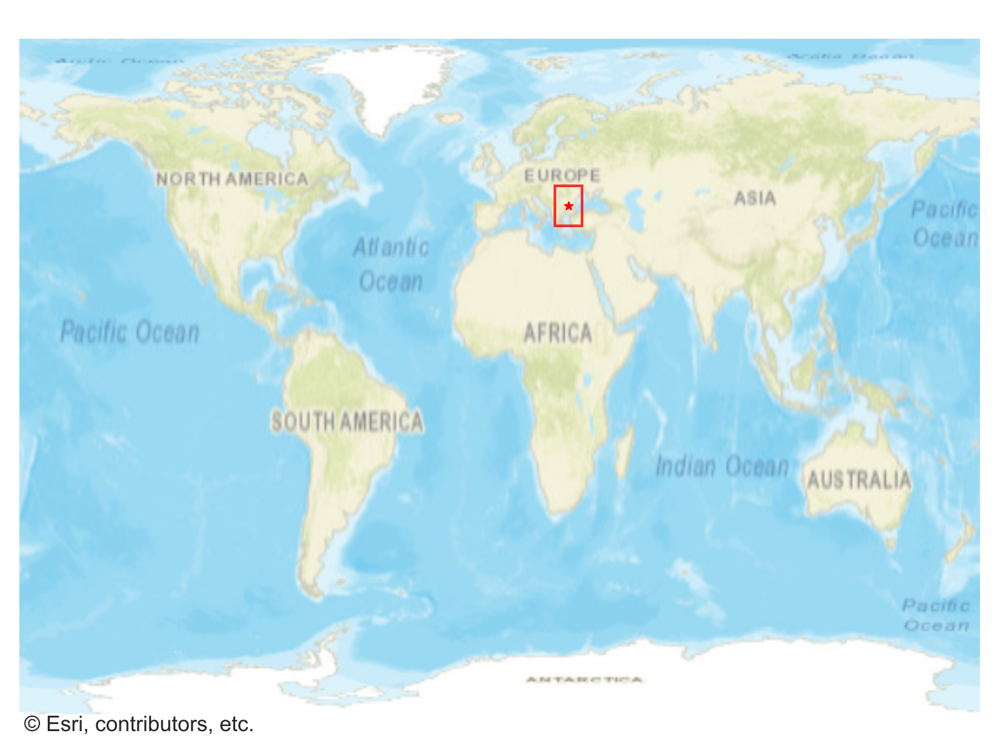
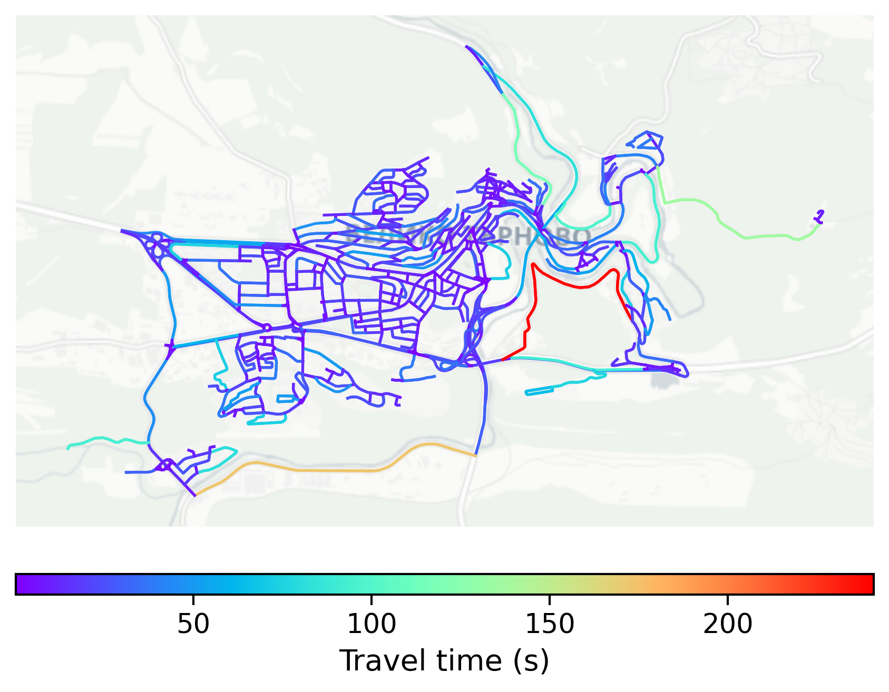

# Veliko_Tarnovo, Bulgaria

#### Location Information

- **City**: Veliko_Tarnovo
- **Country**: Bulgaria
- **Data Source**: OpenStreetMap

- **Analysis Date**: 2025-10-10

#### Road network topology

#### Network Characteristics

##### Basic Topology

- **Number of Nodes**: 648
- **Number of Edges**: 1,533
- **Network Density**: 0.003656
- **Average Node Degree**: 4.731
- **Standard Deviation of Node Degrees**: 1.674

##### Clustering Properties

- **Global Clustering Coefficient**: 0.089869
- **Average Local Clustering Coefficient**: 0.086608
- **Degree Assortativity Coefficient**: 0.294522

##### Spatial Metrics

- **Total Network Length (meters)**: 231290.61
- **Average Edge Length (meters)**: 150.87
- **Average Travel Time per Edge (seconds)**: 15.03

---
*Report generated on 2025-10-10 18:23:30*
