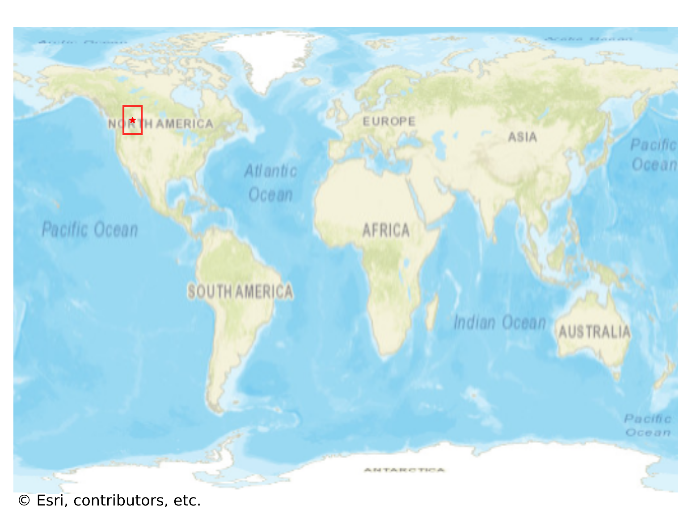
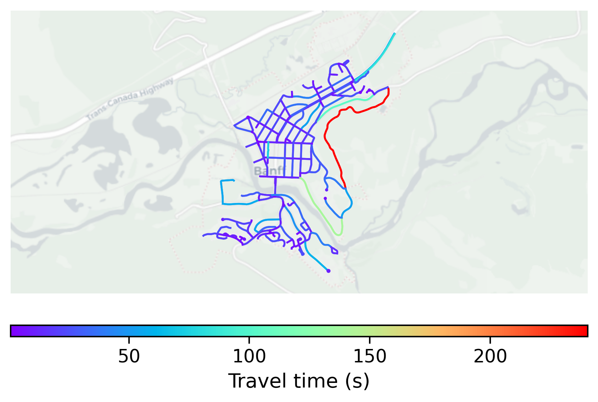

# Banff, Canada

#### Location Information

- **City**: Banff
- **Country**: Canada
- **Data Source**: OpenStreetMap

- **Analysis Date**: 2025-10-10

#### Road network topology

#### Network Characteristics

##### Basic Topology

- **Number of Nodes**: 175
- **Number of Edges**: 453
- **Network Density**: 0.014877
- **Average Node Degree**: 5.177
- **Standard Deviation of Node Degrees**: 1.820

##### Clustering Properties

- **Global Clustering Coefficient**: 0.063291
- **Average Local Clustering Coefficient**: 0.057971
- **Degree Assortativity Coefficient**: 0.173868

##### Spatial Metrics

- **Total Network Length (meters)**: 68416.51
- **Average Edge Length (meters)**: 151.03
- **Average Travel Time per Edge (seconds)**: 18.33

---
*Report generated on 2025-10-10 18:23:31*
