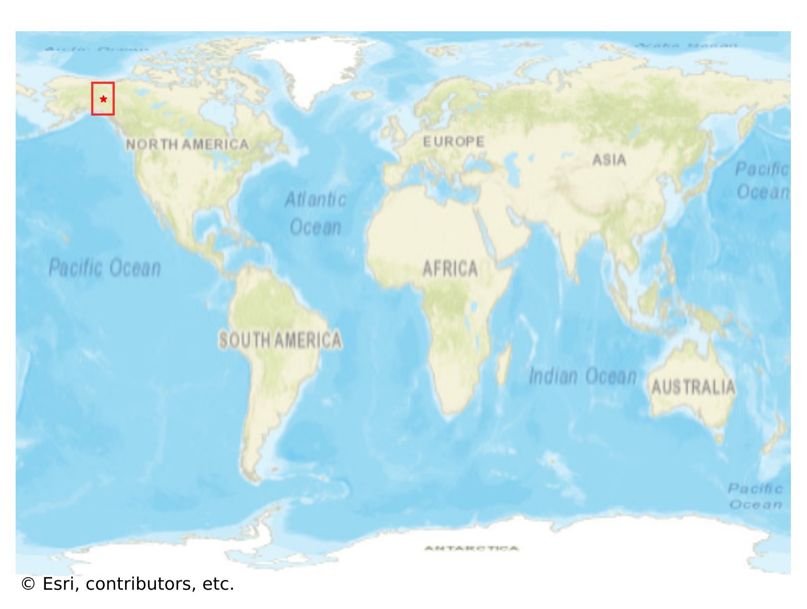
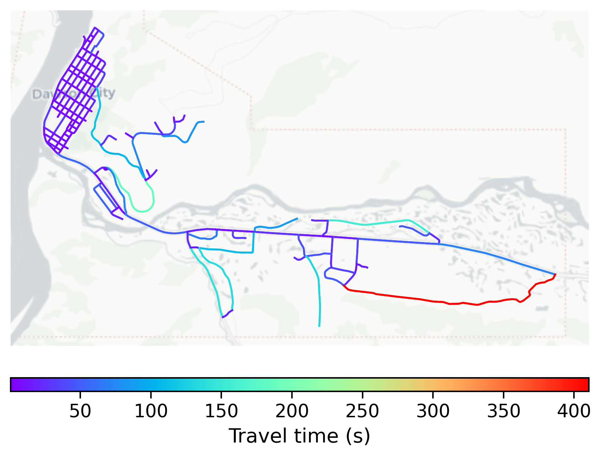

# Dawson_City, Canada

#### Location Information

- **City**: Dawson_City
- **Country**: Canada
- **Data Source**: OpenStreetMap

- **Analysis Date**: 2025-10-10

#### Road network topology

#### Network Characteristics

##### Basic Topology

- **Number of Nodes**: 149
- **Number of Edges**: 444
- **Network Density**: 0.020134
- **Average Node Degree**: 5.960
- **Standard Deviation of Node Degrees**: 1.903

##### Clustering Properties

- **Global Clustering Coefficient**: 0.035785
- **Average Local Clustering Coefficient**: 0.040682
- **Degree Assortativity Coefficient**: 0.240106

##### Spatial Metrics

- **Total Network Length (meters)**: 99783.79
- **Average Edge Length (meters)**: 224.74
- **Average Travel Time per Edge (seconds)**: 21.63

---
*Report generated on 2025-10-10 18:23:34*
