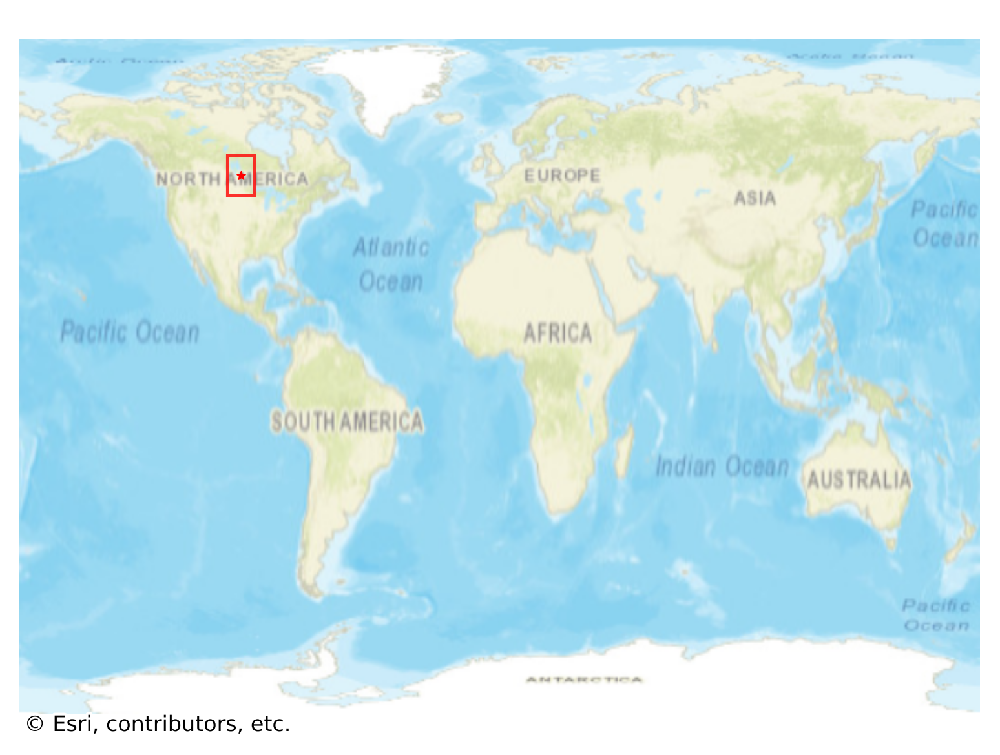
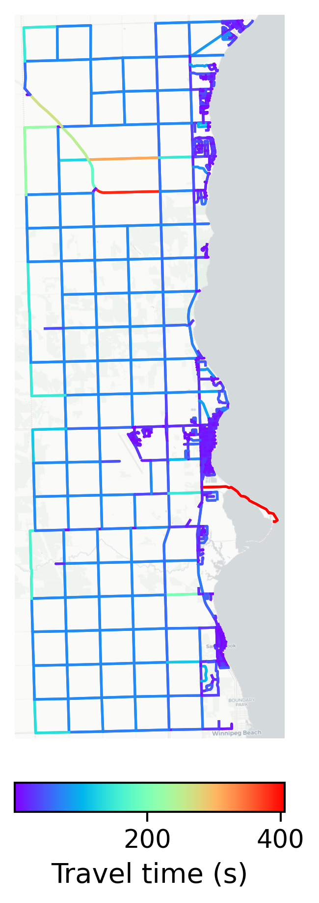

# Gimli, Canada

#### Location Information

- **City**: Gimli
- **Country**: Canada
- **Data Source**: OpenStreetMap

- **Analysis Date**: 2025-10-10

#### Road network topology

#### Network Characteristics

##### Basic Topology

- **Number of Nodes**: 695
- **Number of Edges**: 1,991
- **Network Density**: 0.004128
- **Average Node Degree**: 5.729
- **Standard Deviation of Node Degrees**: 1.987

##### Clustering Properties

- **Global Clustering Coefficient**: 0.050481
- **Average Local Clustering Coefficient**: 0.060303
- **Degree Assortativity Coefficient**: 0.144139

##### Spatial Metrics

- **Total Network Length (meters)**: 1004647.15
- **Average Edge Length (meters)**: 504.59
- **Average Travel Time per Edge (seconds)**: 28.97

---
*Report generated on 2025-10-10 18:23:41*
