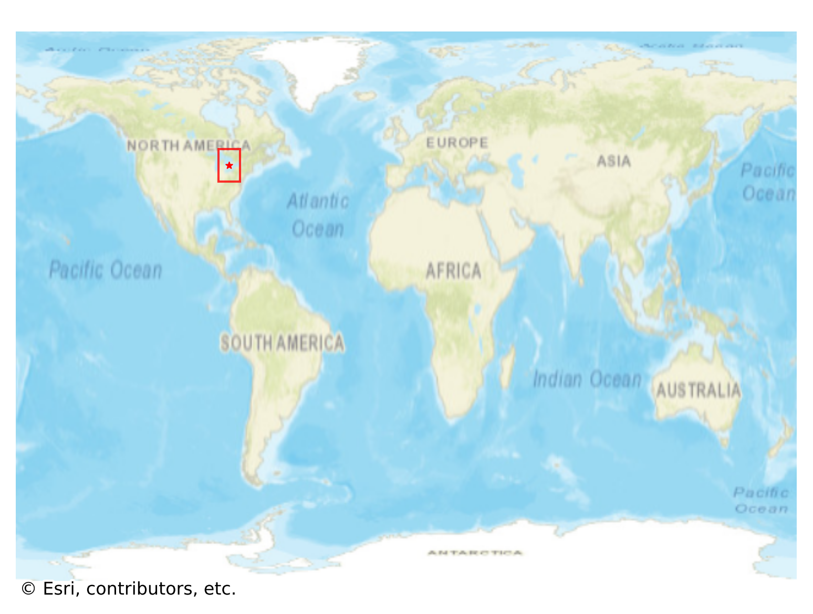

# Goderich, Canada

#### Location Information

- **City**: Goderich
- **Country**: Canada
- **Data Source**: OpenStreetMap

- **Analysis Date**: 2025-10-10

#### Road network topology

#### Network Characteristics

##### Basic Topology

- **Number of Nodes**: 309
- **Number of Edges**: 948
- **Network Density**: 0.009961
- **Average Node Degree**: 6.136
- **Standard Deviation of Node Degrees**: 1.718

##### Clustering Properties

- **Global Clustering Coefficient**: 0.048913
- **Average Local Clustering Coefficient**: 0.054061
- **Degree Assortativity Coefficient**: 0.140853

##### Spatial Metrics

- **Total Network Length (meters)**: 144377.95
- **Average Edge Length (meters)**: 152.30
- **Average Travel Time per Edge (seconds)**: 13.03

---
*Report generated on 2025-10-10 18:23:44*
