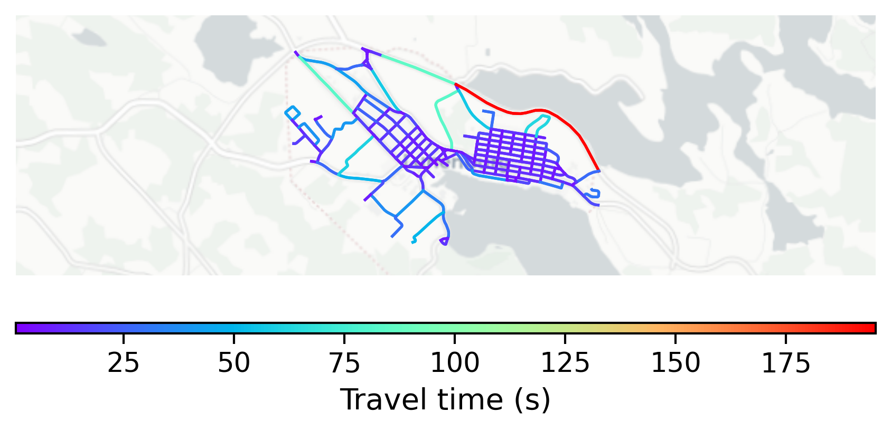

# Lunenburg, Canada

#### Location Information

- **City**: Lunenburg
- **Country**: Canada
- **Data Source**: OpenStreetMap

- **Analysis Date**: 2025-10-10

#### Road network topology

#### Network Characteristics

##### Basic Topology

- **Number of Nodes**: 171
- **Number of Edges**: 509
- **Network Density**: 0.017509
- **Average Node Degree**: 5.953
- **Standard Deviation of Node Degrees**: 1.740

##### Clustering Properties

- **Global Clustering Coefficient**: 0.043339
- **Average Local Clustering Coefficient**: 0.051198
- **Degree Assortativity Coefficient**: 0.310978

##### Spatial Metrics

- **Total Network Length (meters)**: 61152.09
- **Average Edge Length (meters)**: 120.14
- **Average Travel Time per Edge (seconds)**: 14.42

---
*Report generated on 2025-10-10 16:05:47*
