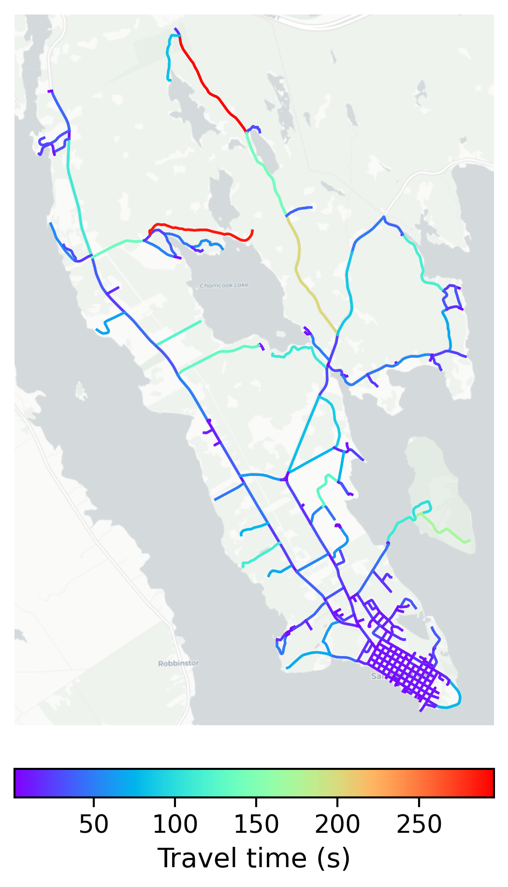

# St_Andrews, Canada

#### Location Information

- **City**: St_Andrews
- **Country**: Canada
- **Data Source**: OpenStreetMap

- **Analysis Date**: 2025-10-10

#### Road network topology

#### Network Characteristics

##### Basic Topology

- **Number of Nodes**: 290
- **Number of Edges**: 752
- **Network Density**: 0.008973
- **Average Node Degree**: 5.186
- **Standard Deviation of Node Degrees**: 2.172

##### Clustering Properties

- **Global Clustering Coefficient**: 0.034929
- **Average Local Clustering Coefficient**: 0.037302
- **Degree Assortativity Coefficient**: 0.226634

##### Spatial Metrics

- **Total Network Length (meters)**: 220823.12
- **Average Edge Length (meters)**: 293.65
- **Average Travel Time per Edge (seconds)**: 21.74

---
*Report generated on 2025-10-10 18:23:51*
