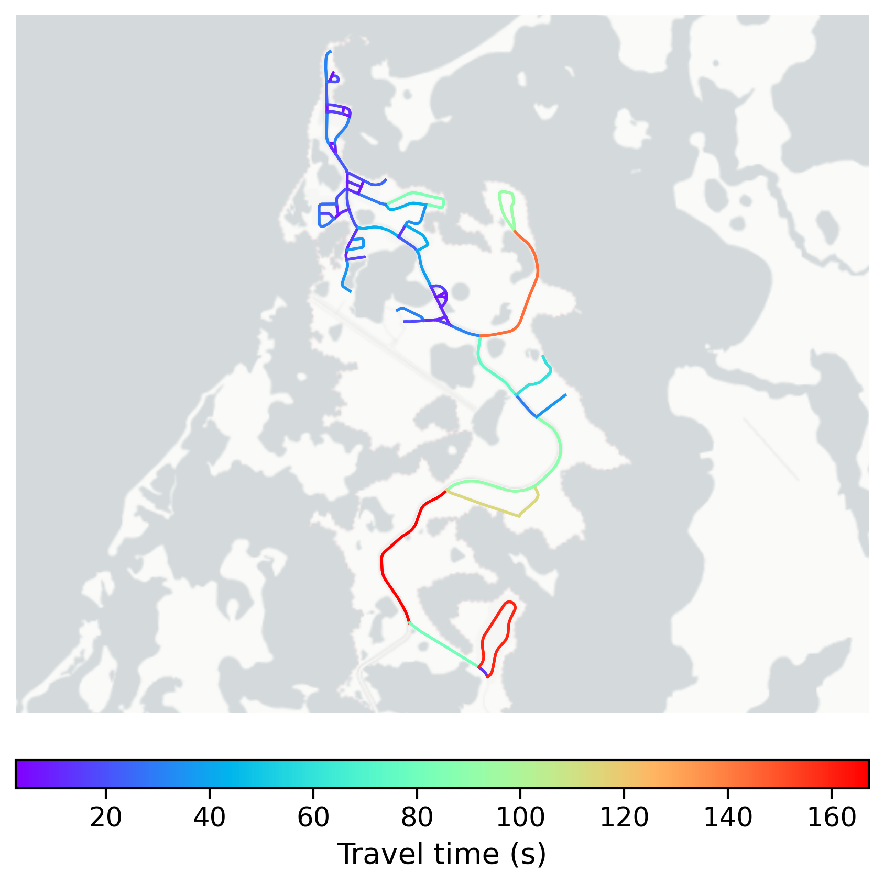

# Tuktoyaktuk, Canada

#### Location Information

- **City**: Tuktoyaktuk
- **Country**: Canada
- **Data Source**: OpenStreetMap

- **Analysis Date**: 2025-10-10

#### Road network topology

#### Network Characteristics

##### Basic Topology

- **Number of Nodes**: 59
- **Number of Edges**: 158
- **Network Density**: 0.046172
- **Average Node Degree**: 5.356
- **Standard Deviation of Node Degrees**: 1.493

##### Clustering Properties

- **Global Clustering Coefficient**: 0.121951
- **Average Local Clustering Coefficient**: 0.104167
- **Degree Assortativity Coefficient**: -0.048884

##### Spatial Metrics

- **Total Network Length (meters)**: 39410.12
- **Average Edge Length (meters)**: 249.43
- **Average Travel Time per Edge (seconds)**: 29.93

---
*Report generated on 2025-10-10 16:05:54*
