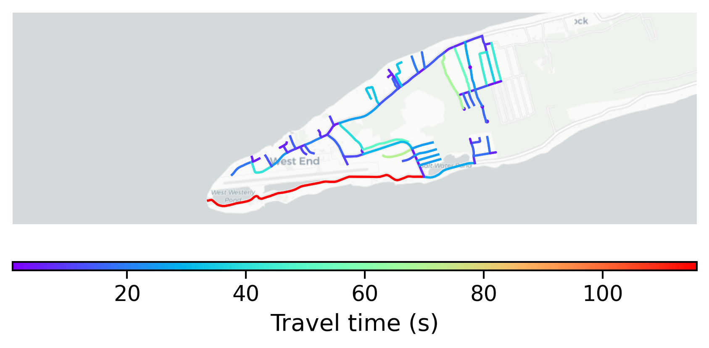

# West_End, Cayman Islands

#### Location Information

- **City**: West_End
- **Country**: Cayman Islands
- **Data Source**: OpenStreetMap

- **Analysis Date**: 2025-10-09

#### Road network topology

#### Network Characteristics

##### Basic Topology

- **Number of Nodes**: 87
- **Number of Edges**: 186
- **Network Density**: 0.024860
- **Average Node Degree**: 4.276
- **Standard Deviation of Node Degrees**: 1.946

##### Clustering Properties

- **Global Clustering Coefficient**: 0.020690
- **Average Local Clustering Coefficient**: 0.019231
- **Degree Assortativity Coefficient**: -0.286123

##### Spatial Metrics

- **Total Network Length (meters)**: 42591.94
- **Average Edge Length (meters)**: 228.99
- **Average Travel Time per Edge (seconds)**: 16.50

---
*Report generated on 2025-10-09 19:17:04*
