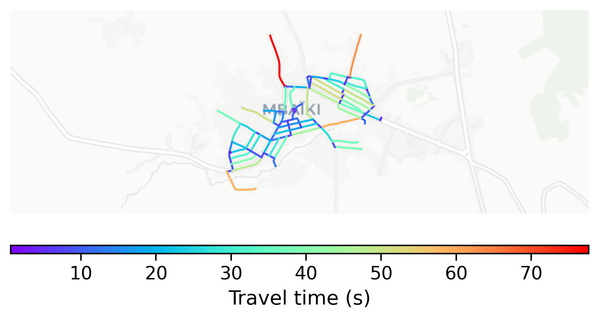

# Mbaiki, Central African Republic

#### Location Information

- **City**: Mbaiki
- **Country**: Central African Republic
- **Data Source**: OpenStreetMap

- **Analysis Date**: 2025-10-10

#### Road network topology

#### Network Characteristics

##### Basic Topology

- **Number of Nodes**: 91
- **Number of Edges**: 251
- **Network Density**: 0.030647
- **Average Node Degree**: 5.516
- **Standard Deviation of Node Degrees**: 1.633

##### Clustering Properties

- **Global Clustering Coefficient**: 0.070039
- **Average Local Clustering Coefficient**: 0.073840
- **Degree Assortativity Coefficient**: 0.221154

##### Spatial Metrics

- **Total Network Length (meters)**: 38136.89
- **Average Edge Length (meters)**: 151.94
- **Average Travel Time per Edge (seconds)**: 18.23

---
*Report generated on 2025-10-10 16:05:58*
