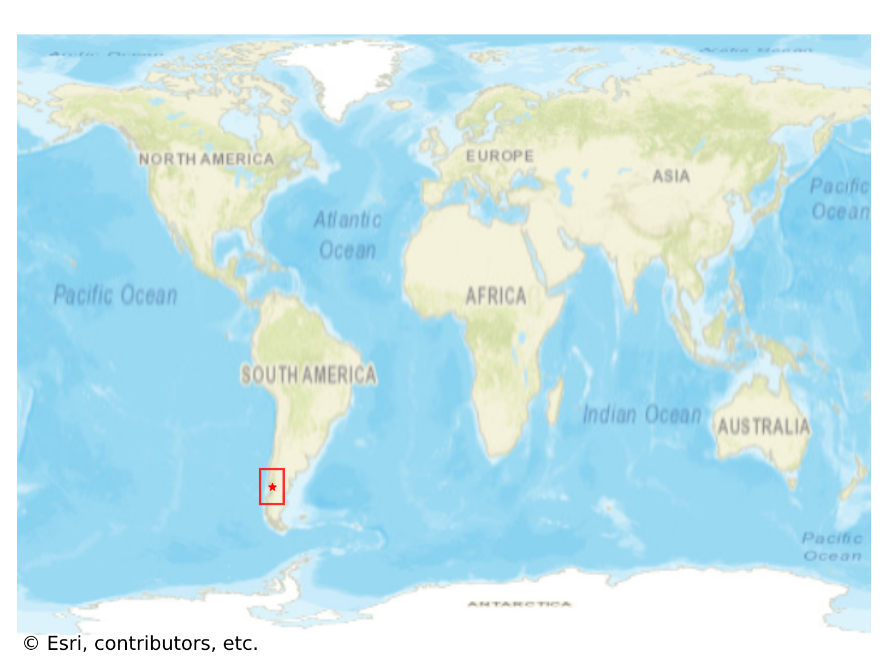

# Chaiten, Chile

#### Location Information

- **City**: Chaiten
- **Country**: Chile
- **Data Source**: OpenStreetMap

- **Analysis Date**: 2025-10-10

#### Road network topology

#### Network Characteristics

##### Basic Topology

- **Number of Nodes**: 432
- **Number of Edges**: 948
- **Network Density**: 0.005092
- **Average Node Degree**: 4.389
- **Standard Deviation of Node Degrees**: 1.558

##### Clustering Properties

- **Global Clustering Coefficient**: 0.038760
- **Average Local Clustering Coefficient**: 0.045311
- **Degree Assortativity Coefficient**: 0.244117

##### Spatial Metrics

- **Total Network Length (meters)**: 631520.17
- **Average Edge Length (meters)**: 666.16
- **Average Travel Time per Edge (seconds)**: 51.93

---
*Report generated on 2025-10-10 16:06:01*
