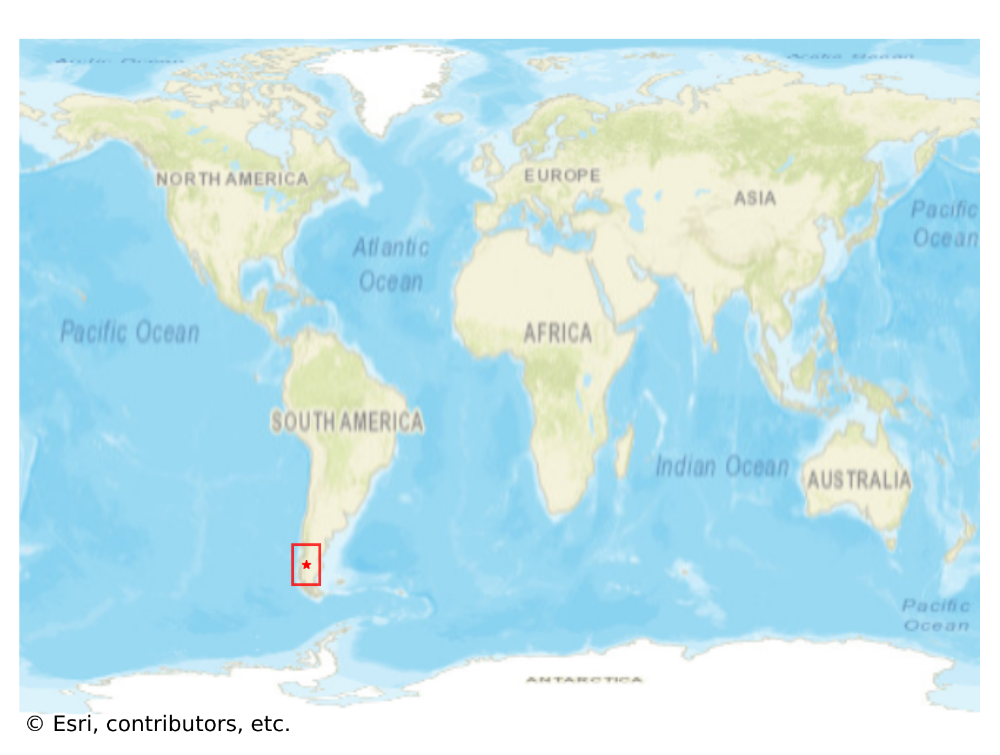
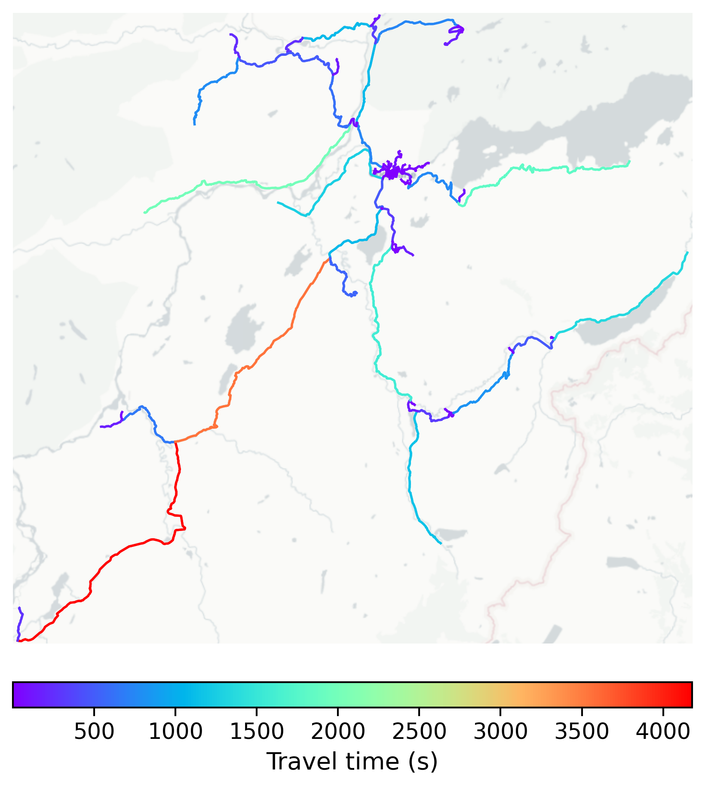

# Cochrane, Chile

#### Location Information

- **City**: Cochrane
- **Country**: Chile
- **Data Source**: OpenStreetMap

- **Analysis Date**: 2025-10-09

#### Road network topology

#### Network Characteristics

##### Basic Topology

- **Number of Nodes**: 284
- **Number of Edges**: 752
- **Network Density**: 0.009356
- **Average Node Degree**: 5.296
- **Standard Deviation of Node Degrees**: 1.918

##### Clustering Properties

- **Global Clustering Coefficient**: 0.053444
- **Average Local Clustering Coefficient**: 0.056773
- **Degree Assortativity Coefficient**: 0.162536

##### Spatial Metrics

- **Total Network Length (meters)**: 816511.01
- **Average Edge Length (meters)**: 1085.79
- **Average Travel Time per Edge (seconds)**: 91.78

---
*Report generated on 2025-10-09 19:17:11*
