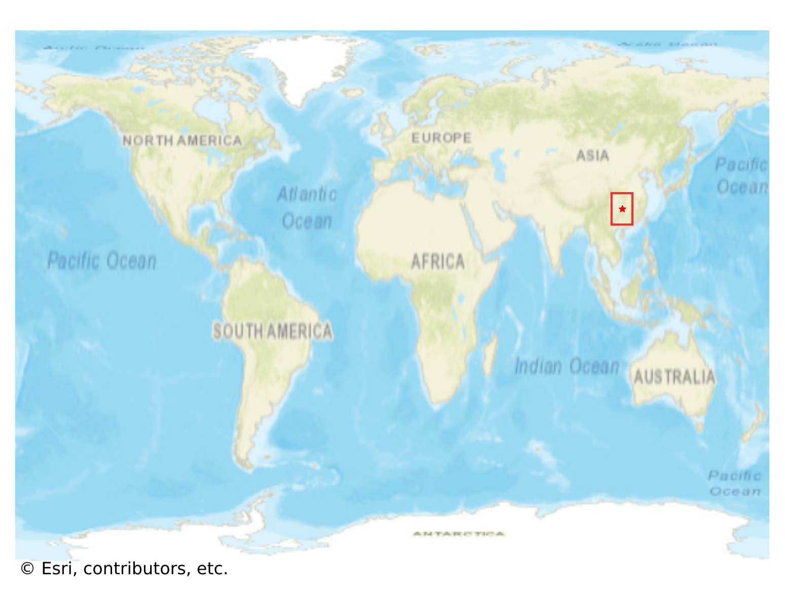
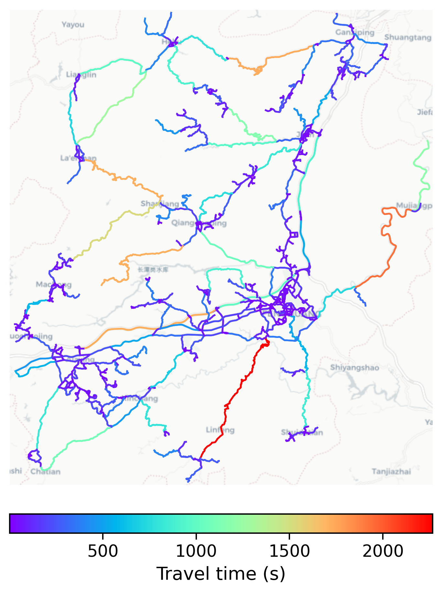

# Fenghuang, China

#### Location Information

- **City**: Fenghuang
- **Country**: China
- **Data Source**: OpenStreetMap

- **Analysis Date**: 2025-10-10

#### Road network topology

#### Network Characteristics

##### Basic Topology

- **Number of Nodes**: 738
- **Number of Edges**: 1,653
- **Network Density**: 0.003039
- **Average Node Degree**: 4.480
- **Standard Deviation of Node Degrees**: 1.906

##### Clustering Properties

- **Global Clustering Coefficient**: 0.046723
- **Average Local Clustering Coefficient**: 0.046601
- **Degree Assortativity Coefficient**: -0.042657

##### Spatial Metrics

- **Total Network Length (meters)**: 1613101.30
- **Average Edge Length (meters)**: 975.86
- **Average Travel Time per Edge (seconds)**: 117.10

---
*Report generated on 2025-10-10 18:24:04*
