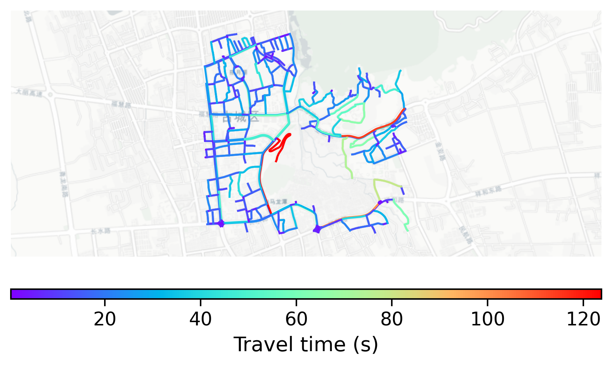

# Lijiang_Old_Town, China

#### Location Information

- **City**: Lijiang_Old_Town
- **Country**: China
- **Data Source**: OpenStreetMap

- **Analysis Date**: 2025-10-10

#### Road network topology

#### Network Characteristics

##### Basic Topology

- **Number of Nodes**: 325
- **Number of Edges**: 692
- **Network Density**: 0.006572
- **Average Node Degree**: 4.258
- **Standard Deviation of Node Degrees**: 1.555

##### Clustering Properties

- **Global Clustering Coefficient**: 0.068182
- **Average Local Clustering Coefficient**: 0.078865
- **Degree Assortativity Coefficient**: 0.210705

##### Spatial Metrics

- **Total Network Length (meters)**: 94854.11
- **Average Edge Length (meters)**: 137.07
- **Average Travel Time per Edge (seconds)**: 16.45

---
*Report generated on 2025-10-10 18:24:09*
