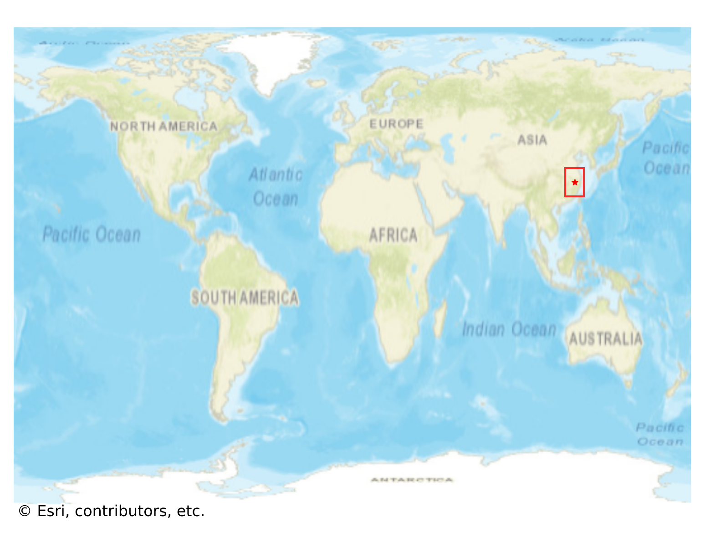
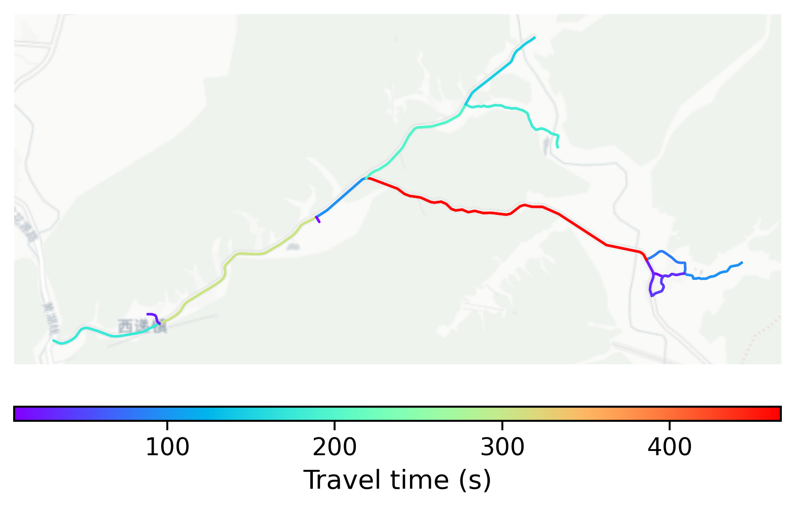

# Xidi, China

#### Location Information

- **City**: Xidi
- **Country**: China
- **Data Source**: OpenStreetMap

- **Analysis Date**: 2025-10-10

#### Road network topology

#### Network Characteristics

##### Basic Topology

- **Number of Nodes**: 15
- **Number of Edges**: 32
- **Network Density**: 0.152381
- **Average Node Degree**: 4.267
- **Standard Deviation of Node Degrees**: 1.914

##### Clustering Properties

- **Global Clustering Coefficient**: 0.120000
- **Average Local Clustering Coefficient**: 0.185185
- **Degree Assortativity Coefficient**: -0.308176

##### Spatial Metrics

- **Total Network Length (meters)**: 32303.55
- **Average Edge Length (meters)**: 1009.49
- **Average Travel Time per Edge (seconds)**: 121.14

---
*Report generated on 2025-10-10 16:06:16*
