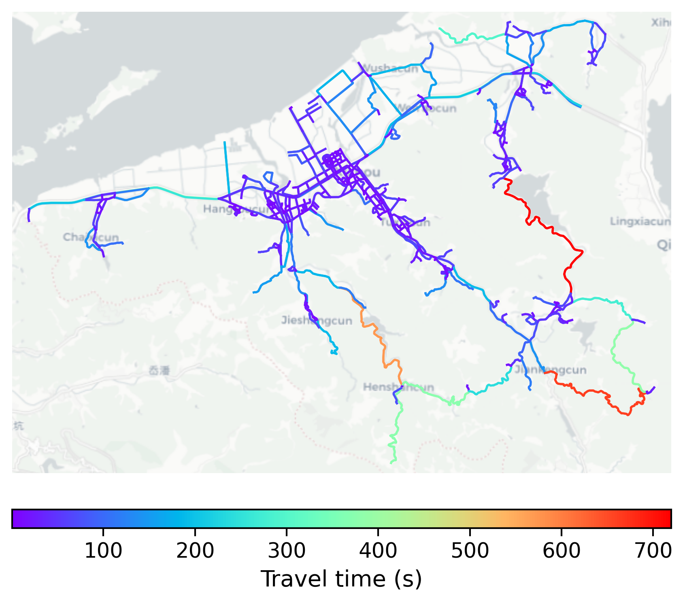

# Xizhou, China

#### Location Information

- **City**: Xizhou
- **Country**: China
- **Data Source**: OpenStreetMap

- **Analysis Date**: 2025-10-09

#### Road network topology

#### Network Characteristics

##### Basic Topology

- **Number of Nodes**: 520
- **Number of Edges**: 1,326
- **Network Density**: 0.004913
- **Average Node Degree**: 5.100
- **Standard Deviation of Node Degrees**: 1.903

##### Clustering Properties

- **Global Clustering Coefficient**: 0.056094
- **Average Local Clustering Coefficient**: 0.059113
- **Degree Assortativity Coefficient**: -0.008034

##### Spatial Metrics

- **Total Network Length (meters)**: 407296.72
- **Average Edge Length (meters)**: 307.16
- **Average Travel Time per Edge (seconds)**: 36.86

---
*Report generated on 2025-10-09 19:17:21*
