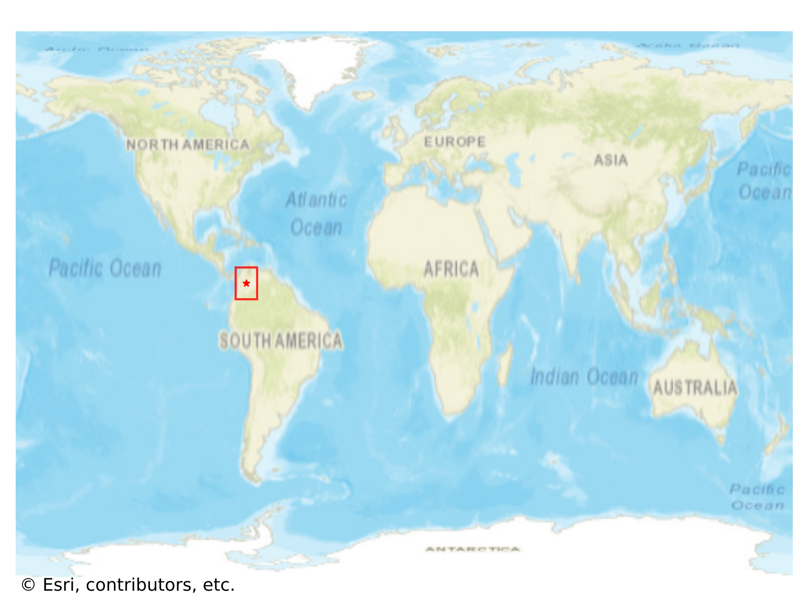

# Barichara, Colombia

#### Location Information

- **City**: Barichara
- **Country**: Colombia
- **Data Source**: OpenStreetMap

- **Analysis Date**: 2025-10-10

#### Road network topology

#### Network Characteristics

##### Basic Topology

- **Number of Nodes**: 644
- **Number of Edges**: 1,707
- **Network Density**: 0.004122
- **Average Node Degree**: 5.301
- **Standard Deviation of Node Degrees**: 1.935

##### Clustering Properties

- **Global Clustering Coefficient**: 0.055462
- **Average Local Clustering Coefficient**: 0.055666
- **Degree Assortativity Coefficient**: 0.177387

##### Spatial Metrics

- **Total Network Length (meters)**: 561562.66
- **Average Edge Length (meters)**: 328.98
- **Average Travel Time per Edge (seconds)**: 39.27

---
*Report generated on 2025-10-10 18:24:17*
