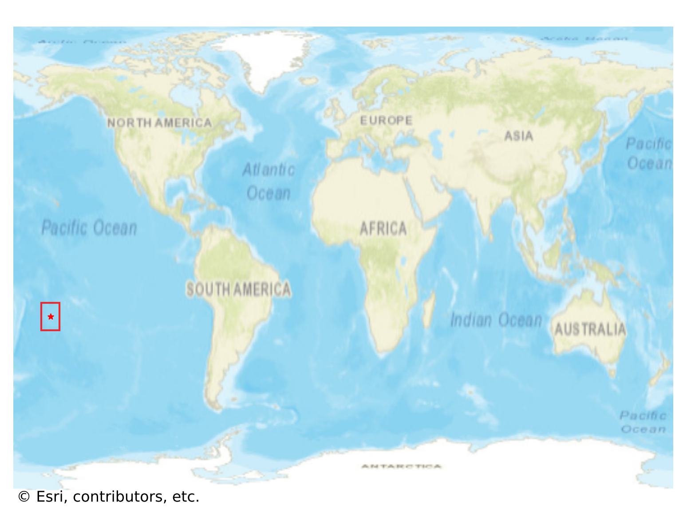
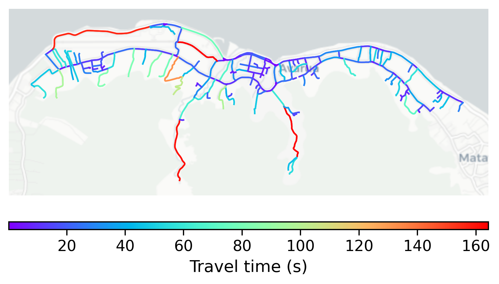

# Avarua, Cook Islands

#### Location Information

- **City**: Avarua
- **Country**: Cook Islands
- **Data Source**: OpenStreetMap

- **Analysis Date**: 2025-10-10

#### Road network topology

#### Network Characteristics

##### Basic Topology

- **Number of Nodes**: 229
- **Number of Edges**: 505
- **Network Density**: 0.009672
- **Average Node Degree**: 4.410
- **Standard Deviation of Node Degrees**: 1.847

##### Clustering Properties

- **Global Clustering Coefficient**: 0.090543
- **Average Local Clustering Coefficient**: 0.090062
- **Degree Assortativity Coefficient**: -0.019696

##### Spatial Metrics

- **Total Network Length (meters)**: 103737.49
- **Average Edge Length (meters)**: 205.42
- **Average Travel Time per Edge (seconds)**: 23.62

---
*Report generated on 2025-10-10 18:24:19*
