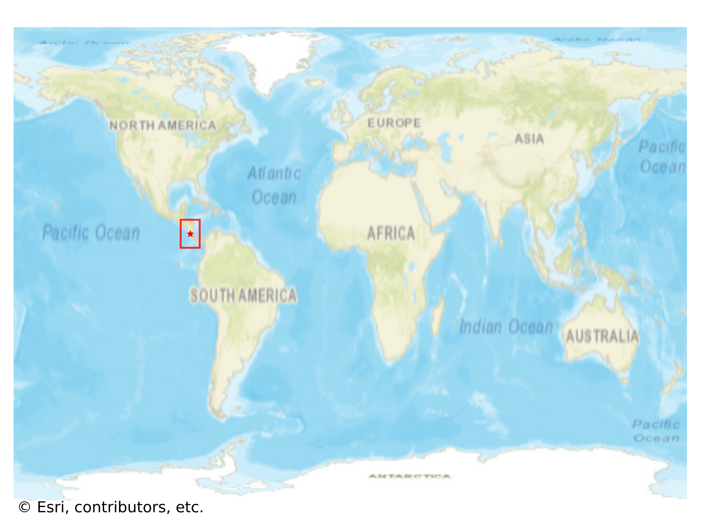

# Santa_Elena, Costa Rica

#### Location Information

- **City**: Santa_Elena
- **Country**: Costa Rica
- **Data Source**: OpenStreetMap

- **Analysis Date**: 2025-10-10

#### Road network topology

#### Network Characteristics

##### Basic Topology

- **Number of Nodes**: 148
- **Number of Edges**: 355
- **Network Density**: 0.016317
- **Average Node Degree**: 4.797
- **Standard Deviation of Node Degrees**: 1.993

##### Clustering Properties

- **Global Clustering Coefficient**: 0.062130
- **Average Local Clustering Coefficient**: 0.059804
- **Degree Assortativity Coefficient**: -0.085767

##### Spatial Metrics

- **Total Network Length (meters)**: 244235.63
- **Average Edge Length (meters)**: 687.99
- **Average Travel Time per Edge (seconds)**: 82.56

---
*Report generated on 2025-10-10 18:24:20*
