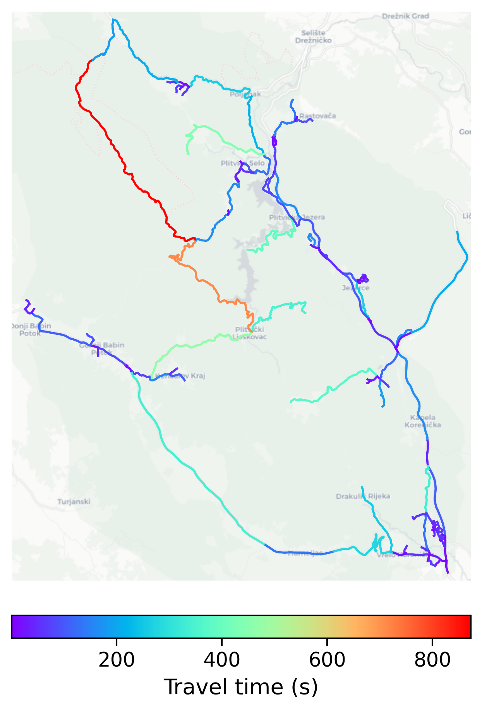

# Plitvice_Lakes, Croatia

#### Location Information

- **City**: Plitvice_Lakes
- **Country**: Croatia
- **Data Source**: OpenStreetMap

- **Analysis Date**: 2025-10-09

#### Road network topology

#### Network Characteristics

##### Basic Topology

- **Number of Nodes**: 151
- **Number of Edges**: 323
- **Network Density**: 0.014260
- **Average Node Degree**: 4.278
- **Standard Deviation of Node Degrees**: 1.842

##### Clustering Properties

- **Global Clustering Coefficient**: 0.076642
- **Average Local Clustering Coefficient**: 0.067657
- **Degree Assortativity Coefficient**: -0.144140

##### Spatial Metrics

- **Total Network Length (meters)**: 285550.03
- **Average Edge Length (meters)**: 884.06
- **Average Travel Time per Edge (seconds)**: 77.91

---
*Report generated on 2025-10-09 19:17:28*
