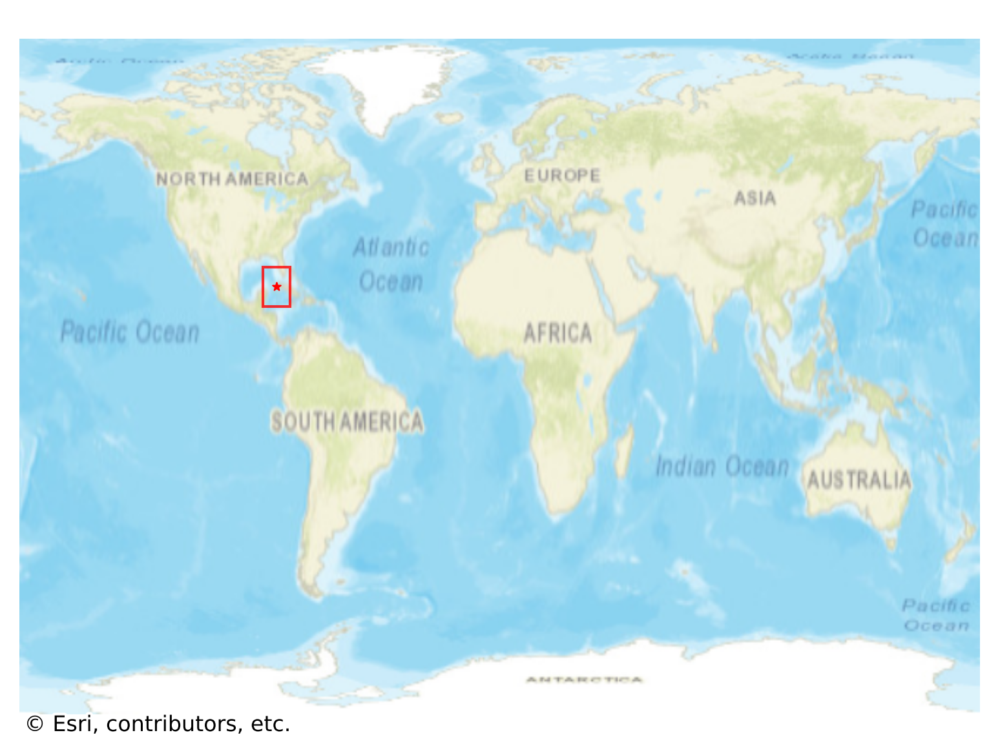
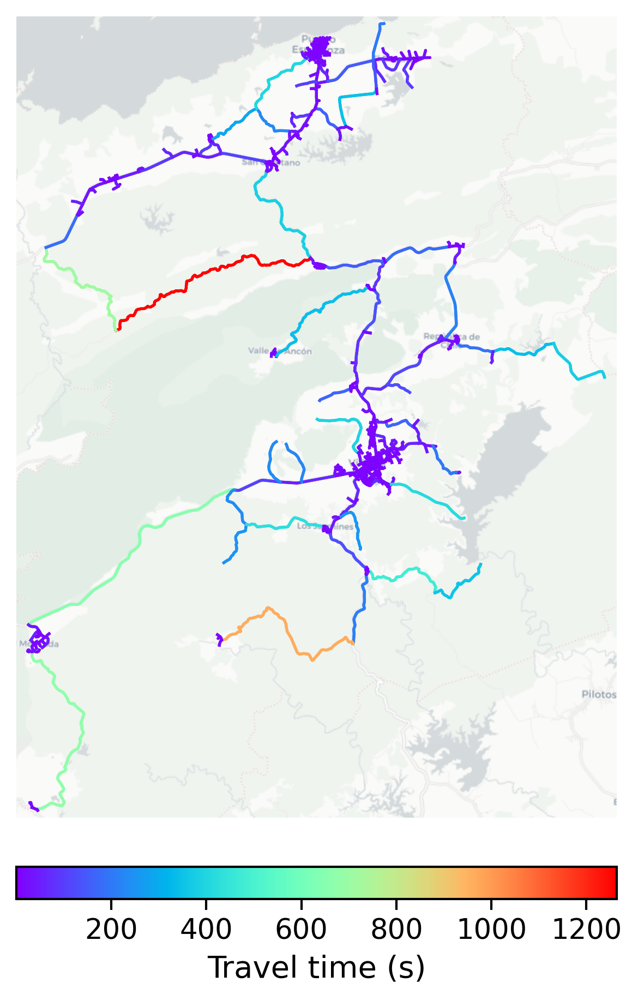

# Vinales, Cuba

#### Location Information

- **City**: Vinales
- **Country**: Cuba
- **Data Source**: OpenStreetMap

- **Analysis Date**: 2025-10-10

#### Road network topology

#### Network Characteristics

##### Basic Topology

- **Number of Nodes**: 635
- **Number of Edges**: 1,525
- **Network Density**: 0.003788
- **Average Node Degree**: 4.803
- **Standard Deviation of Node Degrees**: 2.040

##### Clustering Properties

- **Global Clustering Coefficient**: 0.072165
- **Average Local Clustering Coefficient**: 0.073705
- **Degree Assortativity Coefficient**: -0.029082

##### Spatial Metrics

- **Total Network Length (meters)**: 512108.27
- **Average Edge Length (meters)**: 335.81
- **Average Travel Time per Edge (seconds)**: 29.51

---
*Report generated on 2025-10-10 16:06:34*
