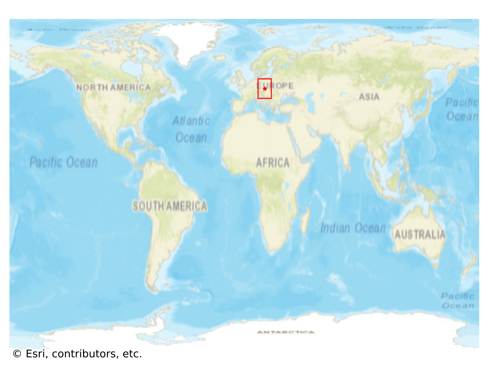
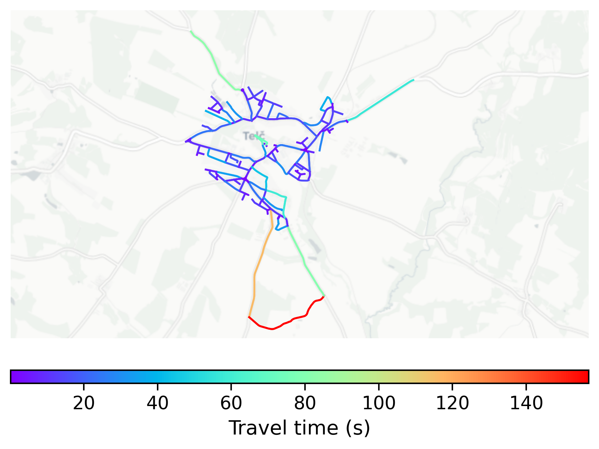

# Telč, Czechia

#### Location Information

- **City**: Telč
- **Country**: Czechia
- **Data Source**: OpenStreetMap

- **Analysis Date**: 2025-10-10

#### Road network topology

#### Network Characteristics

##### Basic Topology

- **Number of Nodes**: 159
- **Number of Edges**: 364
- **Network Density**: 0.014489
- **Average Node Degree**: 4.579
- **Standard Deviation of Node Degrees**: 1.799

##### Clustering Properties

- **Global Clustering Coefficient**: 0.146552
- **Average Local Clustering Coefficient**: 0.154062
- **Degree Assortativity Coefficient**: -0.072313

##### Spatial Metrics

- **Total Network Length (meters)**: 55465.06
- **Average Edge Length (meters)**: 152.38
- **Average Travel Time per Edge (seconds)**: 13.38

---
*Report generated on 2025-10-10 16:06:43*
