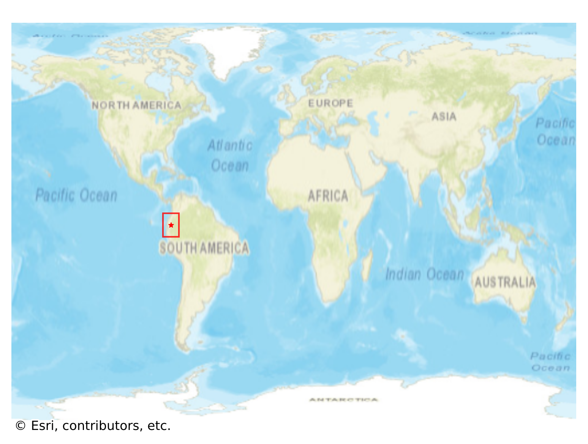
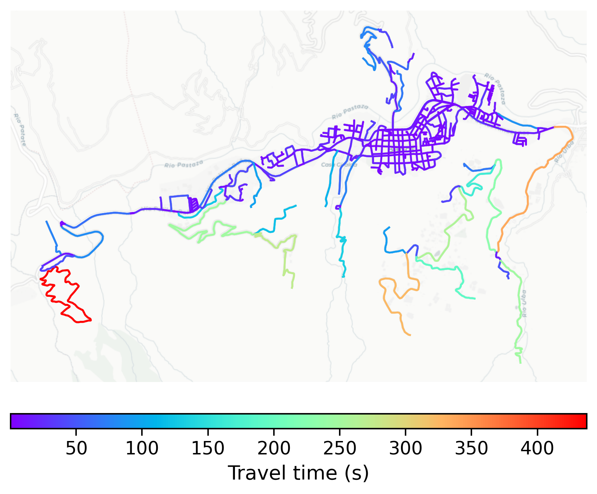

# Baños_de_Agua_Santa, Ecuador

#### Location Information

- **City**: Baños_de_Agua_Santa
- **Country**: Ecuador
- **Data Source**: OpenStreetMap

- **Analysis Date**: 2025-10-10

#### Road network topology

#### Network Characteristics

##### Basic Topology

- **Number of Nodes**: 439
- **Number of Edges**: 1,008
- **Network Density**: 0.005242
- **Average Node Degree**: 4.592
- **Standard Deviation of Node Degrees**: 1.802

##### Clustering Properties

- **Global Clustering Coefficient**: 0.043294
- **Average Local Clustering Coefficient**: 0.044883
- **Degree Assortativity Coefficient**: 0.063151

##### Spatial Metrics

- **Total Network Length (meters)**: 179602.11
- **Average Edge Length (meters)**: 178.18
- **Average Travel Time per Edge (seconds)**: 17.02

---
*Report generated on 2025-10-10 18:24:38*
