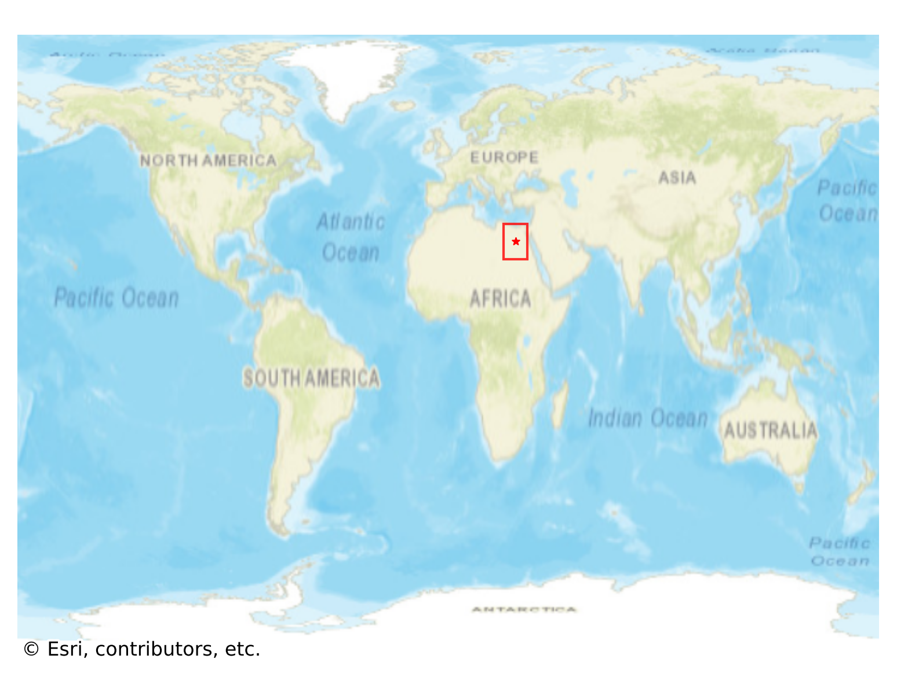
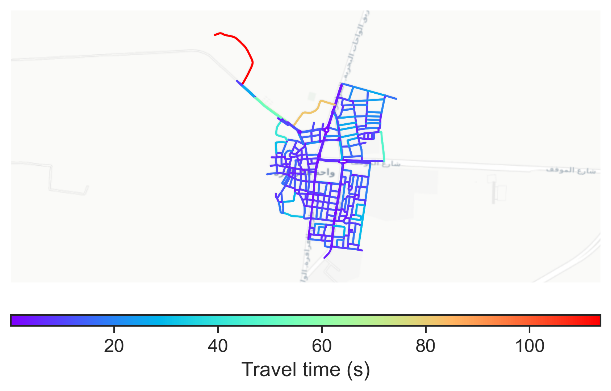

# Farafra, Egypt

#### Location Information

- **City**: Farafra
- **Country**: Egypt
- **Data Source**: OpenStreetMap

- **Analysis Date**: 2025-10-10

#### Road network topology

#### Network Characteristics

##### Basic Topology

- **Number of Nodes**: 372
- **Number of Edges**: 1,001
- **Network Density**: 0.007253
- **Average Node Degree**: 5.382
- **Standard Deviation of Node Degrees**: 1.560

##### Clustering Properties

- **Global Clustering Coefficient**: 0.026591
- **Average Local Clustering Coefficient**: 0.030726
- **Degree Assortativity Coefficient**: 0.512562

##### Spatial Metrics

- **Total Network Length (meters)**: 81372.10
- **Average Edge Length (meters)**: 81.29
- **Average Travel Time per Edge (seconds)**: 8.99

---
*Report generated on 2025-10-10 16:06:51*
